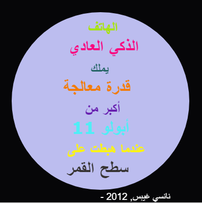

## المقدمة

في هذا المشروع ستقوم بإنشاء قاموس ألوان يربط رموز الألوان صعبة الحفظ مع أسماء مألوفة وسهلة.

  <iframe src="https://trinket.io/embed/python/97822f48b7?outputOnly=true&start=result" width="600" height="500" frameborder="0" marginwidth="0" marginheight="0" allowfullscreen>
  </iframe>
  

### معلومات إضافية لقادة النادي

إذا كنت بحاجة لطباعة هذا المشروع، فيُرجى استخدام [النسخة القابلة للطباعة](https://projects.raspberrypi.org/en/projects/colourful-creations/print).

## \--- collapse \---

## title: ملاحظات قادة النادي

## مقدمة:

نتعرف خلال هذا المشروع على القواميس من خلال إنشاء قاموس يربط أسماء الألوان المعروفة مع رموزها اللونية. ثم يتم البحث عن الرمز اللوني في القاموس واستخدامه لتصميم ملصق ملون جميل.

## الموارد المتوفرة على الإنترنت

** يستخدم هذا المشروع Python 3. ** نوصي باستخدام [trinket](https://trinket.io/) للكتابة بلغة الـ Python عبر الانترنت. يحتوي هذا المشروع على الـ Trinket التالية:

* [نقطة بدء "تصاميم ملونة" -- jumpto.cc/python-new](http://jumpto.cc/python-new)

كما يوجد مشروع trinket يحتوي على نموذج حل للتحديات:

* [نموذج كامل لـ "تصاميم ملونة" -- trinket.io/python/41a99e668b](https://trinket.io/python/97822f48b7)

## الموارد المتوفرة دون اتصال بالإنترنت

يمكن تطبيق هذا المشروع بشكل كامل [دون اتصال بالانترنت](https://www.codeclubprojects.org/en-GB/resources/python-working-offline/) إن كنت تفضل ذلك. يمكنك الوصول إلى موارد المشروع من خلال النقر فوق رابط "مواد المشروع" الخاص بهذا المشروع. يحتوي هذا الرابط على قسم "موارد المشروع"، الذي يتضمن الموارد التي يحتاج إليها الأطفال لإكمال هذا المشروع دون اتصال بالإنترنت. تأكد من أن كل طفل لديه إمكانية الوصول إلى نسخة من هذه الموارد. يتضمن هذا القسم الملفات التالية:

* colourful-creations/colourful-creations.py

You can also find a completed version of this project's challenges in the 'Club leader resources' section, which contains:

* colourful-creations-finished/colourful-creations.py

(جميع الموارد المذكورة أعلاه قابلة للتحميل أيضاً كملفات `.zip` للمشاريع والمتطوعين)

## أهداف التعلم

* قواميس - إنشاء القيم والبحث عنها؛
* رسومات السلحفاة - النص والخطوط والألوان؛

يتناول هذا المشروع عناصر من معايير [المناهج الرقمية الخاصة بـ Raspberry Pi](http://rpf.io/curriculum) التالية:

* [استخدام التراكيب البرمجية الأساسية لإنشاء برامج بسيطة.](https://www.raspberrypi.org/curriculum/programming/creator)

* [تصميم نماذج ثنائية وثلاثية البعد.](https://www.raspberrypi.org/curriculum/design/creator)

## التحديات

* المزيد من الألوان! - استخدم أيّ من مواقع أدوات انتقاء الألوان لإيجاد الرمز اللوني للمزيد من الألوان وأضفها إلى القاموس. 
* إنشاء ملصق - قم بإنشاء قاموس لوحة لونية جديد واستخدمه لتصميم ملصق باستخدام رسومات السلحفاة. 

## الأسئلة الشائعة

* من الممكن أن نحتاج لتذكير الأطفال باستخدام الفاصلة "," في نهاية كل عنصر مدخَل في القاموس. 

\--- /collapse \---

## \--- collapse \---

## title: مواد المشروع

## موارد المشروع

* [ملف.zip يحتوي على كل موارد المشروع](resources/colourful-creations-project-resources.zip)
* [Python Trinket فارغ على الانترنت](http://jumpto.cc/python-new)
* [ملف Python فارغ بدون الاتصال بالانترنت](resources/new-new.py)

## موارد قادة النادي

* [ملف.zip يحتوي على جميع موارد المشروع المكتملة](resources/colourful-creations-volunteer-resources.zip)
* [مشروع Trinket المكتمل على الإنترنت](https://trinket.io/python/97822f48b7)
* [colourful-creations-finished/colourful-creations.py](resources/colourful-creations-finished-colourful-creations.py)

\--- /collapse \---