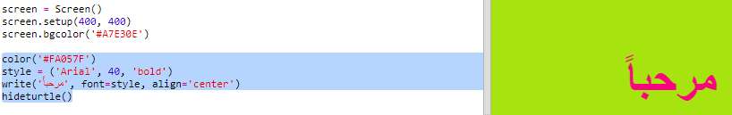

## استخدام الرموز اللونية الست عشرية

تملك سلحفاة (Python turtle) مجموعة من الألوان معرّفة مسبقاً، مثل "أحمر" و "أبيض"، وبإمكانك أيضاً استخدام الرموز اللونية الست عشرية (على الأرجح أن قد رأيتهم في دورة كل من HTML وCSS)

+ افتح الـ Trinket الذي يحتوي على قالب Python فارغ: <a href="http://jumpto.cc/python-new" target="_blank">jumpto.cc/python-new</a>.

+ أضف كود التهيئة التالي لاستخدام السلحفاة:
    
    
    
    لاحظ أنك استخدمت لون له اسم معروف "أبيض": 'white'.

+ تملك السلحفاة قائمة من أسماء الألوان التي تستطيع استخدامها، ولكن في بعض الأحيان قد ترغب باختيار ألوانك الخاصة. تتيح لك السلحفاة أيضاً إمكانية استخدام الرموز اللونية الست عشرية.
    
    قم بفتح <a href="http://jumpto.cc/colour-picker" target="_blank">jumpto.cc/colour-picker</a> واختر اللون الذي تريده. ابحث عن الرمز السداسي عشر والذي يبدأ بـ "#"، مثل الرمز "#A7E30E".

+ انسخ الرمز اللوني، متضمناً الـ #، من خلال تحديده بالفأرة ومن ثم ضغط الزر الأيمن واختيار نسخ أو الضغط على زر Ctrl و C في لوحة المفاتيح.

+ والآن قم بتعديل السطر البرمجي الذي يحدد لون الشاشة واستخدم اللون الذي اخترته. مثال:
    
    
    
    بإمكانك ضغط الزر الأيمن للفأرة واختيار لصق أو الضغط على زر Ctrl و V في لوحة المفاتيح لتقوم بنسخ الرمز اللوني الذي ترغب به إلى الـ trinket.

+ فم باختيار رمز لوني آخر واستخدمه لإنشاء نص ملوّن جديد:
    
    
    
    ليس من الضروري استخدام نوع الخط "Arial"، بإمكانك تجربة الخطوط "Verdana"، "Times" أو "Courier".
    
    الرقم "40" هو حجم الخط، تستطيع أن تجرب تغييره أيضاً.

+ تابع تجربة المزيد من الألوان المختلفة حتى تجد لونين تعتقد أنهم يبدوان متناسبين جداً معاً.