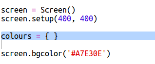

## قاموس ألوان

 
إن استخدام أكواد الألوان السداسية سهل بالفعل، لكن يصعب تذكُّر هذه الأكواد. 

ربما تعرف أن القاموس يسمح لك بالبحث عن كلمة والاطلاع على معناها. لكن في Python، يكون القاموس أكثر مرونة لدرجة أنه - يسمح لك بالبحث عن قيمة لأي 'مفتاح' في القاموس.

لننشئ قاموسًا لربط أسماء الألوان التي يعرفها المستخدم (المفاتيح) بالأكواد السداسية التي يعرفها الكمبيوتر (القيم).

+ يكون القاموس بين قوسَين متعرِّجَين. 

  أنشئ قاموسًا فارغًا يُسمى `colours`:

   
   
+ اختر أسماء سهلة لألوانك وقم بتحرير السطر `colours = ` لتضيف إلى القاموس إدخالات لهذه الأسماء. 

  إليك مثالًا لقاموس ألوان:

   
   
   تفصل العلامة `:` بين المفتاح (اسم اللون) والقيمة (الكود السداسي). كما أنك ستحتاج إلى استخدام فاصلة `,` بعد كل زوج مفتاح : قيمة في القاموس. 

+ لن تحتاج الآن إلى تذكُّر الأكواد السداسية، فكل ما عليك فعله هو البحث عنها في القاموس. 

  عدِّل التعليمات البرمجية التالية لتستخدم أسماء الألوان التي أنشأتها:
  
  
  
  يوضع المفتاح داخل قوسين مربعين '[]' بعد اسم القاموس. 
  
+ يمكنك الآن تحديث تعليماتك البرمجية لتبحث عن الألوان في القاموس:

  
  
  
+ اختبر التعليمات البرمجية للتأكد من استمرار ظهور النص باللون الصحيح. 

