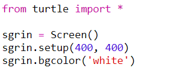
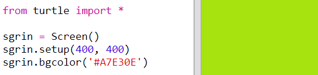
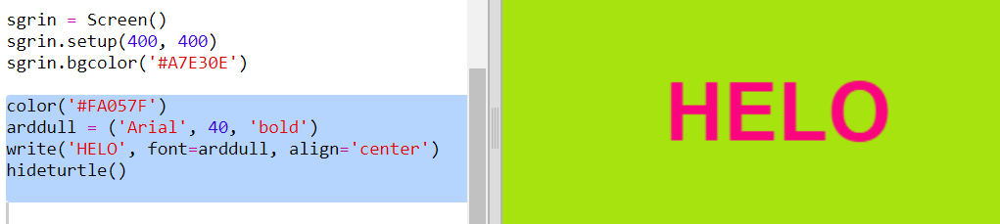

## Defnyddio codau lliw hecs

Mae gan grwban Python liwiau rhagddiffiniedig fel 'coch' a 'gwyn' ond gallwch hefyd ddefnyddio codau lliw hecs (efallai eich bod chi wedi gweld y rhain yn y cwrs HTML & CSS.)

+ Agorwch y templed Python gwag Trinket: <a href="http://jumpto.cc/python-new" target="_blank">jumpto.cc/python-new</a>.

+ Ychwanegwch y cod sefydlu canlynol ar gyfer defnyddio'r crwban:
    
    
    
    Sylwch eich bod wedi defnyddio lliw a enwir: 'gwyn'.

+ Mae gan Grwban restr o enwau lliw y gallwch eu defnyddio, ond weithiau rydych chi'n dymuno dewis eich lliwiau eich hun. Mae Crwban hefyd yn caniatáu i chi ddefnyddio codau lliw hecs.
    
    Agorwch <a href="http://jumpto.cc/colour-picker" target="_blank">jumpto.cc/colour-picker</a> a dewiswch liw rydych chi'n ei hoffi. Darganfyddwch ei god hecs gan ddechrau gyda '#', fel' #A7E30E'.

+ Copïwch y cod hecs, gan gynnwys y nod clwyd, gan ei amlygu ac yna de-glicio a dewis 'Copy', neu ddefnyddio Ctrl-C.

+ Nawr newidiwch linell y cod sy'n gosod lliw y sgrin i ddefnyddio'ch lliw. Er enghraifft:
    
    
    
    Gallwch ddefnyddio de-glicio a 'Paste' neu Ctrl-V i gludo eich cod hecs i mewn i trinket.

+ Dewiswch god lliw hecs arall a'i ddefnyddio i greu testun lliw:
    
    
    
    Does dim rhaid i chi ddefnyddio'r ffont 'Arial'; gallech roi cynnig ar 'Verdana', 'Times' neu 'Courier'.
    
    '40' yw maint y ffont - gallwch geisio newid hynny hefyd.

+ Rhowch gynnig ar wahanol liwiau nes i chi gael dau rydych chi wir yn eu hoff ac sy'n edrych yn dda gyda'i gilydd.