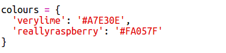

## Geiriadur Lliw

Mae defnyddio codau lliw hecs yn hyblyg iawn ond maent yn anodd i'w cofio.

Fel y gwyddoch yn ôl pob tebyg, mae geiriadur yn eich galluogi i edrych am air, a gweld ei ystyr. Yn Python, mae geiriadur hyd yn oed yn fwy hyblyg na hynny - mae'n eich galluogi i edrych am werth ar gyfer unrhyw 'allwedd' yn y geiriadur.

Gadewch i ni greu geiriadur i fapio o enwau lliw sy'n gyfeillgar i bobl (allweddi) i godau hecs sy'n gyfeillgar i gyfrifiaduron (gwerthoedd).

+ Mae geiriadur wedi'i gynnwys mewn bachau cyrliog.
    
    Crëwch eiriadur gwag o'r enw `lliwiau`:
    
    

+ Dewiswch enwau cŵl ar gyfer eich lliwiau a golygu'r llinell `lliwiau=` i ychwanegu cofnodion i'r geiriadur ar eu cyfer.
    
    Dyma enghraifft o eiriadur lliw:
    
    
    
    Mae colon `:` yn gwahanu'r allwedd (enw lliw) o'r gwerth (cod hecs). Mae angen coma arnoch `,` rhwng pob pâr allwedd:gwerth yn y geiriadur.

+ Nawr, nid oes angen i chi gofio'r codau hecs - gallwch chi chwilio amdanynt yn y geiriadur.
    
    Addaswch y cod canlynol i ddefnyddio'ch enwau lliw:
    
    
    
    Mae'r allwedd yn mynd o fewn bachau petryal '[]' ar ôl enw'r geiriadur.

+ Nawr gallwch chi ddiweddaru'ch cod i chwilio am liwiau yn y geiriadur:
    
    

+ Profwch eich cod i sicrhau bod eich testun yn dal i ddangos yn gywir.