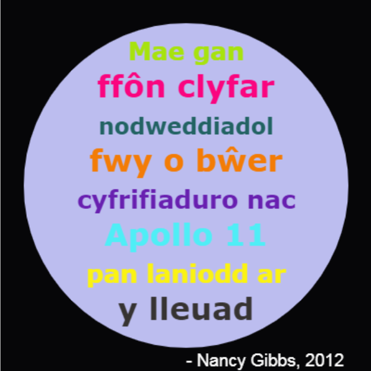

--- challenge ---

## Her: Crëwch boster

Mae dylunwyr yn aml yn creu 'palet' o liwiau sy'n cydweithio'n dda ar gyfer thema benodol fel anialwch neu ofod.

Allwch chi greu prosiect Python newydd sy'n defnyddio geiriadur ar gyfer palet lliw thematig. Gallech ddewis hydref, coedwig, y môr, y Nadolig, hufen iâ, lliwiau eich hoff dîm chwaraeon neu syniad o'ch pen eich hun.

Crëwch boster gan ddefnyddio'ch geiriadur palet lliw.

Gallwch hefyd ddefnyddio gorchmynion crwban eraill rydych chi'n eu hadnabod fel `forward` (ymlaen), `right` (i'r dde), `left` (i'r chwith), `penup` (pin i fyny) a `pendown` (pin i lawr).

Efallai y gallech chi ychwanegu ffin i'ch poster?

Gorchmynion crwban defnyddiol eraill:

+ Mae `circle(50)` (cylch) yn tynnu amlinelliad cylch gyda radiws 50.
+ Mae `dot(100)` yn tynnu cylch wedi'i lenwi â diamedr 100. 

Dyma enghraifft:

--- /challenge ---