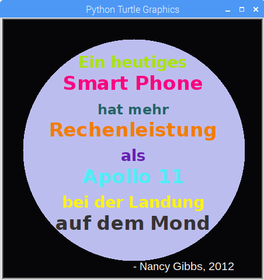

## Einleitung

In diesem Projekt erstellen wir ein "Dictionary" (Deutsch: Wörterbuch) für Farben, das nette Namen für schwer lesbare Farbcodes bereitstellt.

  <iframe src="https://trinket.io/embed/python/41a99e668b?outputOnly=true&start=result" width="600" height="500" frameborder="0" marginwidth="0" marginheight="0" allowfullscreen>
  </iframe>
  

### Zusätzliche Informationen für Clubleiter

Falls du dieses Projekt ausdrucken musst, verwende bitte die [druckfreundliche Version](https://projects.raspberrypi.org/en/projects/colourful-creations/print).

## \--- collapse \---

## title: Anmerkungen für Clubleiter

## Einleitung:

Dieses Projekt stellt "Dictionaries" (Deutsch: Wörterbücher) vor, indem ein Dictionary angelegt wird, das den Hex-Codes für Farben benutzerfreundliche Namen zuordnet. Diese Farbcodes werden dann aus dem „Dictionary“ herausgesucht und für ein farbenfrohes Poster verwendet.

## Online-Ressourcen

**Dieses Projekt verwendet Python 3.** Wir empfehlen die Verwendung von [trinket](https://trinket.io/), um Python-Programme online zu schreiben. Dieses Projekt enthält die folgenden Trinkets:

* [‘Kunterbunte Kreationen' Start -- jumpto.cc/python-new](http://jumpto.cc/python-new)

Es gibt auch ein Trinket mit einer Beispiellösung für die Herausforderungen:

* [Fertiges Beispiel 'Kunterbunte Kreationen' - trinket.io/python/41a99e668b](https://trinket.io/python/41a99e668b)

## Offline-Ressourcen

Dieses Projekt kann, falls gewünscht, auch [offline bearbeitet](https://www.codeclubprojects.org/en-GB/resources/python-working-offline/) werden. Sie können auf die Projektressourcen zugreifen, indem Sie auf den Link "Projektmaterial" für dieses Projekt klicken. Dieser Link enthält einen Abschnitt "Projektressourcen" mit Ressourcen, die die Kinder benötigen, um das Projekt offline abschließen zu können. Stelle sicher, dass jedes Kind Zugriff auf eine Kopie dieser Ressourcen hat. Dieser Abschnitt enthält die folgenden Dateien:

* colourful-creations/colourful-creations.py

Eine vollständige Version dieses Projekts finden Sie auch im Abschnitt "Ressourcen für Freiwillige". Diese enthält:

* colourful-creations-finished/colourful-creations.py

(Alle oben genannten Ressourcen können auch als `.zip`-Dateien für Projekte und für Freiwillige heruntergeladen werden.)

## Lernziele

* Dictionaries - Anlegen und Nachschlagen von Werten;
* Turtle-Grafik - Text, Schriftarten und Farben;

Dieses Projekt umfasst Elemente aus den folgenden Strängen des [Raspberry Pi Digital Making Curriculum](http://rpf.io/curriculum):

* [Verwendung elementarer Programmiersprachelemente zur Erstellung einfacher Programme.](https://www.raspberrypi.org/curriculum/programming/creator)

* [Entwerfen einfacher 2D- und 3D-Grafiken.](https://www.raspberrypi.org/curriculum/design/creator)

## Herausforderungen

* Mehr Farben! - Verwende eine Website mit Farbauswahlwerkzeug, um Hex-Codes für weitere Farben herauszufinden und das Dictionary damit zu erweitern. 
* Entwerfe ein Poster - Erstelle dein eigenes Farbpaletten-Wörterbuch und verwende es, um ein Poster mit Turtle-Grafik zu kreieren. 

## Häufig Gestellte Fragen

* Kinder müssen möglicherweise an das Komma "," am Ende jedes Dictionaryeintrags erinnert werden. 

\--- /collapse \---

## \--- collapse \---

## title: Projektmaterial

## Projektressourcen

* [.zip-Datei, die alle Projektressourcen enthält](resources/colourful-creations-project-resources.zip)
* [leeres Python-Trinket - online](http://jumpto.cc/python-new)
* [leere Python-Datei - offline](resources/new-new.py)

## Ressourcen für Clubleiter

* [.zip-Datei, die alle fertig gestellten Projektressourcen enthält](resources/colourful-creations-volunteer-resources.zip)
* [Vollständiges Trinket-Projekt (online)](https://trinket.io/python/41a99e668b)
* [colourful-creations-finished/colourful-creations.py](resources/colourful-creations-finished-colourful-creations.py)

\--- /collapse \---