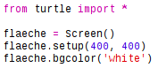
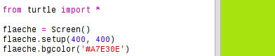
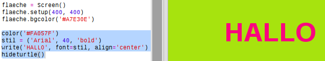

## Hexadezimalcodes für Farben

Python-Turtle besitzt vordefinierte Farben wie 'red' für rot und 'white' für weiß, aber du kannst auch hexadezimale Farbcodes verwenden. (Vielleicht kennst Du die schon aus dem HTML- & CSS-Kurs.)

+ Öffne das leere Python-Vorlage-Trinket: <a href="http://jumpto.cc/python-new" target="_blank">jumpto.cc/python-new</a>.

+ Gebe für die Verwendung von Turtle (deutsch: Schildkröte) den folgenden Setup-Code ein:
    
    
    
    Beachte: Du hast für die Farbe einen Namen ("weiß") verwendet.

+ Turtle besitzt eine Liste von Farbnamen, die Du verwenden kannst, manchmal möchte man aber seine ganz eigenen Farben aussuchen. Turtle erlaubt dir auch die Verwendung von Hex-Farbcodes.
    
    Öffne <a href="http://jumpto.cc/colour-picker" target="_blank">https://developer.mozilla.org/de/docs/Web/CSS/CSS_Colors/farbauswahl_werkzeug</a> und suche eine Farbe aus, die dir gefällt. Finde den Hex-Code der Farbe, er beginnt mit einem '#', z. B. "#A7E30E".

+ Kopiere den Hex-Code einschließlich des Rautezeichens, indem Du ihn markierst und dann entweder rechtsklickst und "Kopieren" auswählst, oder Strg-C drückst.

+ Ändere jetzt die Codezeile, die die Hintergrundfarbe festlegt, um deine eigene Farbe einzustellen. Zum Beispiel:
    
    
    
    Du kannst Deinen Hex-Code mit einem Rechtsklick und "Einfügen", oder mit den Tasten Strg-V in dein Trinket einzufügen.

+ Suche einen anderen Hex-Farbcode aus und verwende ihn für bunten Text:
    
    
    
    Du musst nicht die Schriftart 'Arial' verwenden, du kannst auch 'Verdana', 'Times' oder 'Courier' ausprobieren.
    
    '40' ist die Schriftgröße, auch diese kannst Du ändern.

+ Probiere verschiedene Farben aus, bis Du zwei findest, die Dir zusammen richtig gut gefallen.