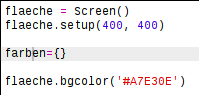
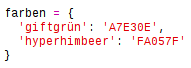
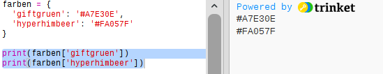
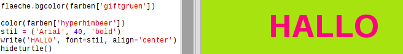

## Ein Farbwörterbuch

Hex-Farbcodes sind zwar sehr flexibel, aber man kann sie sich schlecht merken. 

Wie du wahrscheinlich schon weißt, kann ein Wörterbuch dir dabei helfen, ein Wort nachzuschlagen und dessen Bedeutung herauszufinden. Mit Python ist ein Wörterbuch noch flexibler als das: Es erlaubt dir einen Wert (Value) für jeden 'key' (jedes Schlüsselwort) im Wörterbuch nachzuschlagen.

Lass uns ein Wörterbuch erstellen, um menschenfreundliche Farbnamen (Schlüsselwörter) von den computerfreundlichen Hexadezimalcodes (Werte, bzw. „Values“) umzuwandeln.

+ Das Wörterbuch ist in den geschweiften Klammern enthalten. 

  Erstelle ein leeres Wörterbuch mit dem Namen `colours` (Farben):

   
   
+ Denk dir ein paar coole Namen für deine Farben aus und bearbeite die `colours = {} ` Farbzeile, um weitere Einträge hierfür in dein Wörterbuch einzufügen. 

  Hier ist ein Beispiel für ein Farbwörterbuch:

   
   
   Ein Doppelpunkt `:` trennt das Schlüsselwort (den Farbnamen) von dem Wert, bzw. „Value“ (dem Hexadezimalcode.) Du musst immer ein Komma `,` zwischen jedem „key:value“ (Schlüsselwort:Wert) Paar im Wörterbuch setzen. 

+ Nun brauchst du dir die Hexadezimalcodes nicht mehr zu merken, du kannst sie einfach im Wörterbuch nachschlagen. 

  Bearbeite den folgenden Code, um deine Farbnamen zu benutzen:
  
  
  
  „Key? (das Schlüsselwort) gehört in die eckigen Klammern '[]' nach dem Namen des Wörterbuchs. 
  
+ Jetzt kannst du deinen Code aktualisieren, um im Wörterbuch nach den Farben zu suchen:

  
  
  
+ Teste deinen Code, um sicherzustellen, dass dein Text immer noch richtig angezeigt wird. 
