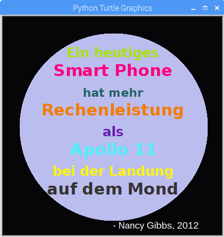

--- challenge ---

## Herausforderung: Entwerfe ein Poster

Designer stellen häufig eine "Palette" von Farben zusammen, die für ein bestimmtes Thema - wie etwa Wüste oder Weltraum - gut zusammenpassen.

Kannst du ein neues Python-Projekt anlegen, das ein Dictionary für eine themenbezogene Farbpalette verwendet? Du könntest ein Thema wie z. B. Herbst, Wald, Meer, Weihnachten, Eiscreme oder die Farben deiner Lieblingssportmannschaft wählen, oder dir selbt etwas ausdenken.

Entwerfe mit deinem Farbpaletten-Dictionary ein Poster.

Du kannst auch andere Turtle-Anweisungen verwenden wie z. B. `forward` (vorwärts), `right` (rechts), `left` (links), `penup` (Stift hoch) und `pendown` (Stift runter).

Vielleicht kannst du deinem Poster auch noch einen Rahmen anpassen?

Weitere nützliche Turtle-Befehle:

+ `circle(50)` zeichnet einen Kreis mit dem Radius 50.
+ `dot(100)` (dot: engl. f. Punkt) zeichnet einen ausgefüllten Kreis mit dem Durchmesser 100. 

Hier ist ein Beispiel:

--- /challenge ---

***
Dieses Projekt wurde von freiwilligen Helfern übersetzt:

**Bernd Albrecht**

**Thorsten Billib**

Dank freiwilliger Helfer können wir Menschen auf der ganzen Welt die Möglichkeit geben, in ihrer eigenen Sprache zu lernen. Du kannst uns helfen, mehr Menschen zu erreichen, indem Du dich freiwillig zum Übersetzen meldest - weitere Informationen unter [rpf.io/translate](https://rpf.io/translate).
