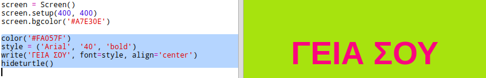

## Χρησιμοποιώντας κωδικούς χρωμάτων hex

Η χελώνα Python έχει προκαθορισμένα χρώματα όπως 'κόκκινο' και 'λευκό', αλλά μπορείτε επίσης να χρησιμοποιήσετε κώδικες hex color (μπορεί να έχετε δει αυτές στο μάθημα CSS HTML &).

+ Ανοίξτε το κενό πρότυπο Python Trinket: <a href="http://jumpto.cc/python-new" target="_blank">jumpto.cc/python-new</a>.

+ Προσθέστε τον ακόλουθο κωδικό ρύθμισης για τη χρήση της χελώνας:
    
    
    
    Παρατηρήστε ότι χρησιμοποιήσατε ένα όνομα χρώματος: 'λευκό'.

+ Η χελώνα έχει μια λίστα με τα ονόματα χρωμάτων που μπορείτε να χρησιμοποιήσετε, αλλά μερικές φορές θέλετε να επιλέξετε τα δικά σας χρώματα. Η χελώνα σας επιτρέπει επίσης να χρησιμοποιείτε δεκαεξαδικούς κωδικούς χρωμάτων.
    
    Ανοίξτε το <a href="http://jumpto.cc/colour-picker" target="_blank">jumpto.cc/colour-picker</a> και επιλέξτε το χρώμα που σας αρέσει. Βρείτε τον εξαγωνικό κώδικα που αρχίζει με ένα '#', όπως το '# A7E30E'.

+ Αντιγράψτε τον δεκαεξαδικό κώδικα, συμπεριλαμβανομένου του κατακερματισμού, επισημαίνοντάς τον και κάνοντας δεξί κλικ και επιλέγοντας Αντιγραφή ή χρησιμοποιώντας το συνδυασμό πλήκτρων Ctrl-C.

+ Τώρα αλλάξτε τη γραμμή κώδικα που ορίζει το χρώμα της οθόνης για να χρησιμοποιήσετε το χρώμα σας. Για παράδειγμα:
    
    
    
    Μπορείτε να χρησιμοποιήσετε δεξί κλικ και Επικόλληση ή Ctrl-V για να επικολλήσετε τον hex κωδικό σας στο μπιχλιμπίδι.

+ Επιλέξτε έναν άλλο κωδικό χρώματος hex και χρησιμοποιήστε τον για να δημιουργήσετε έγχρωμο κείμενο:
    
    
    
    Δεν χρειάζεται να χρησιμοποιήσετε τη γραμματοσειρά 'Arial', μπορείτε να δοκιμάσετε 'Verdana', 'Times' ή 'Courier'.
    
    Το '40' είναι το μέγεθος της γραμματοσειράς, μπορείτε να δοκιμάσετε να αλλάξετε και αυτό.

+ Δοκιμάστε διαφορετικά χρώματα μέχρι να αποκτήσετε δύο που πραγματικά σας αρέσει να φαίνονται καλά μαζί.