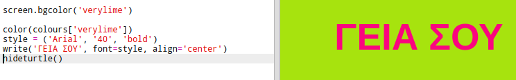

## Ένα Λεξικό Χρωμάτων

Η χρήση δεκαεξαδικών αριθμών χρωμάτων βοηθά στον προγραμματισμό, αλλά είναι δύσκολο να τους θυμόμαστε.

Όπως ίσως ήδη γνωρίζεις, ένα λεξικό σου επιτρέπει να αναζητάς μια λέξη για να διαβάσεις το νόημά της. Στην Python, ένα λεξικό είναι ακόμα πιο ευέλικτο από αυτό - σου επιτρέπει να αναζητήσεις μια τιμή για οποιαδήποτε 'λέξη-κλειδί' στο λεξικό.

Ας δημιουργήσουμε ένα λεξικό για την αντιστοίχιση περιγραφικών ονομάτων χρωμάτων (κλειδιά) με δεκαεξαδικούς αριθμούς (τιμές) που είναι κατανοητοί στον υπολογιστή.

+ Ένα λεξικό περιέχεται σε άγκιστρα '{}'.
    
    Δημιούργησε ένα κενό λεξικό που ονομάζεται `colours`:
    
    

+ Επέλεξε περιγραφικά ονόματα για τα χρώματά σου και επεξεργάσου τη γραμμή `colours =` για να προσθέσεις καταχωρήσεις στο λεξικό για αυτά.
    
    Ακολουθεί ένα παράδειγμα λεξικού χρωμάτων:
    
    
    
    Η άνω-κάτω τελεία `:` χωρίζει το κλειδί (όνομα χρώματος) από την τιμή (δεκαεξαδικός αριθμός). Χρειάζεται ένα κόμμα `,` μεταξύ κάθε ζεύγους κλειδιού:τιμής στο λεξικό.

+ Τώρα δεν είναι ανάγκη να θυμάσαι τους δεκαεξαδικούς αριθμούς, μπορείς απλά να τους αναζητάς στο λεξικό.
    
    Προσάρμοσε τον παρακάτω κώδικα για να χρησιμοποιήσεις τα ονόματα των χρωμάτων σου:
    
    
    
    Το κλειδί μπαίνει μέσα σε άγκιστρα '[]' μετά το όνομα του λεξικού.

+ Τώρα μπορείς να ενημερώσεις τον κώδικά σου για να αναζητήσεις χρώματα στο λεξικό:
    
    

+ Δοκίμασε τον κώδικα για να βεβαιωθείς ότι το κείμενό σου εξακολουθεί να εμφανίζεται σωστά.