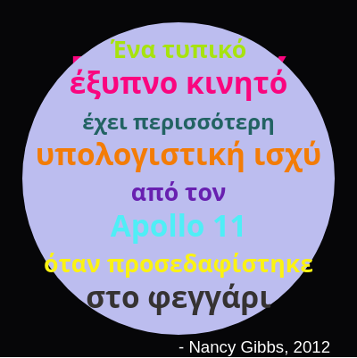

\--- πρόκληση \---

## Πρόκληση: Δημιουργήστε μια αφίσα

Οι σχεδιαστές δημιουργούν συχνά μια «παλέτα» χρωμάτων που δουλεύουν καλά για ένα συγκεκριμένο θέμα όπως η έρημος ή ο χώρος.

Μπορείτε να δημιουργήσετε ένα νέο πρόγραμμα Python που χρησιμοποιεί ένα λεξικό για μια παλέτα χρωμάτων με θέμα. Θα μπορούσατε να επιλέξετε το φθινόπωρο, το δάσος, τη θάλασσα, τα Χριστούγεννα, το παγωτό, τα χρώματα της αγαπημένης σας αθλητικής ομάδας ή μια ιδέα της δικής σας.

Δημιουργήστε μια αφίσα χρησιμοποιώντας το λεξικό παλέτας χρωμάτων.

Μπορείτε επίσης να χρησιμοποιήσετε άλλες εντολές χελώνας που γνωρίζετε όπως `προς τα εμπρός`, `δεξιά`, `αριστερά`, `φτερά` και `περόνα`.

Ίσως θα μπορούσατε να προσθέσετε ένα περίγραμμα στην αφίσα σας;

Άλλες χρήσιμες εντολές χελώνας:

+ `κύκλος (50)` σχεδιάζει ένα περίγραμμα κύκλου με ακτίνα 50.
+ `κουκκίδα (100)` τραβά έναν γεμάτο κύκλο με διάμετρο 100. 

Ακολουθεί ένα παράδειγμα:

\--- / πρόκληση \---