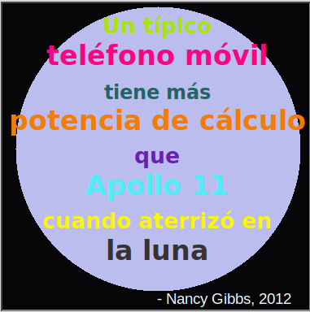

## Introducción

En este proyecto crearás un diccionario de colores que asigna nombres amigables a códigos de color difíciles de recordar.

  <iframe src="https://trinket.io/embed/python/97822f48b7?outputOnly=true&start=result" width="600" height="500" frameborder="0" marginwidth="0" marginheight="0" allowfullscreen>
  </iframe>
  

### Información adicional para líderes de club

Si necesitas imprimir este proyecto, usa la [versión para imprimir](https://projects.raspberrypi.org/en/projects/colourful-creations/print).

## \--- collapse \---

## título: Notas del líder del club

## Introducción:

Este proyecto introduce los diccionarios al crear un diccionario que asigna nombres de colores amigables para las personas a los códigos hexadecimales. Los códigos de color se buscan en el diccionario y se utilizan para crear un póster colorido.

## Recursos en línea

**Este proyecto usa Python 3.** Recomendamos el uso de [trinket](https://trinket.io/) para escribir Python en línea. Este proyecto contiene los Trinkets siguientes:

* [Punto de partida de 'creaciones coloridas' - jumpto.cc/python-new](http://jumpto.cc/python-new)

También hay un Trinket que contiene una solución de ejemplo a los retos:

* ['Creaciones coloreadas' Terminadas -- trinket.io/python/41a99e668b](https://trinket.io/python/97822f48b7)

## Recursos sin conexión

Este proyecto se puede [completar sin conexión](https://www.codeclubprojects.org/en-GB/resources/python-working-offline/) si se prefiere. Se puede acceder a los recursos del proyecto haciendo clic en el enlace 'Materiales del proyecto' para este proyecto. Este enlace contiene una sección de 'Recursos del proyecto', que incluye los recursos que los niños necesitarán para completar este proyecto sin conexión. Asegúrate de que cada niño tenga acceso a una copia de estos recursos. Esta sección incluye los siguientes archivos:

* colourful-creations/colourful-creations.py

You can also find a completed version of this project's challenges in the 'Club leader resources' section, which contains:

* colourful-creations-finished/colourful-creations.py

(Todos los recursos anteriores también se pueden descargar como archivos `.zip` de proyectos y voluntarios.)

## Objetivos del Aprendizaje

* Diccionarios - crear y buscar valores;
* Gráficos de tortuga - texto, fuentes y colores;

Este proyecto incluye elementos de los siguientes aspectos del [currículo de digitalización de Raspberry Pi](http://rpf.io/curriculum):

* [Usar estructuras de programación básicas para crear programas simples.](https://www.raspberrypi.org/curriculum/programming/creator)

* [Diseña elementos básicos en 2D y 3D.](https://www.raspberrypi.org/curriculum/design/creator)

## Retos

* ¡Más colores! - Utiliza un sitio web de selección de colores para buscar códigos hexadecimales de más colores y agregarlos al diccionario. 
* Crea un póster - Crea un diccionario personalizado de paleta de colores y úsalo para crear un póster usando gráficos de Tortuga. 

## Preguntas frecuentes

* Es posible que los niños necesiten recordar usar la coma ',' al final de cada entrada del diccionario. 

\--- /collapse \---

## \--- collapse \---

## title: materiales del proyecto

## Recursos del proyecto

* [archivo .zip que contiene todos los recursos del proyecto](resources/colourful-creations-project-resources.zip)
* [Trinket Python en blanco en línea](http://jumpto.cc/python-new)
* [Trinket Python en blanco sin conexión](resources/new-new.py)

## Recursos para el líder del club

* [archivo .zip que contiene todos los recursos del proyecto](resources/colourful-creations-volunteer-resources.zip)
* [Proyecto Trinket completado en línea](https://trinket.io/python/97822f48b7)
* [colourful-creations-finished/colourful-creations.py](resources/colourful-creations-finished-colourful-creations.py)

\--- /collapse \---