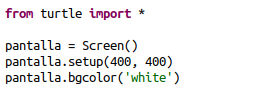
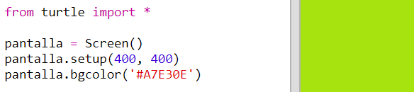
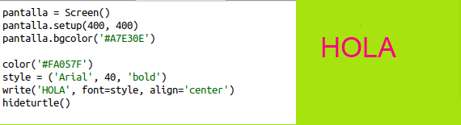

## Usando códigos de color hexadecimales

La tortuga Python tiene colores predefinidos como 'rojo' y 'blanco', pero también puede usar códigos de color hexadecimales (puedes haberlos visto en el curso HTML & CSS)

+ Abre la plantilla Python en blanco en Trinket: <a href="http://jumpto.cc/python-new" target="_blank">jumpto.cc/python-new</a>.

+ Agrega el siguiente código de configuración para usar la tortuga:
    
    
    
    Ten en cuenta que utilizaste un color llamado: 'white'.

+ La tortuga tiene una lista de nombres de colores que puedes usar, pero a veces quieres elegir tus propios colores. La tortuga también te permite usar códigos de color hexadecimales.
    
    Abre <a href="http://jumpto.cc/colour-picker" target="_blank">jumpto.cc/colour-picker</a> y elige el color que te gusta. Encuentra su código hexadecimal que comienza con un '#', por ejemplo '#A7E30E'.

+ Copia el código hexadecimal, incluido el hash, resaltándolo y luego haciendo clic con el botón derecho y seleccionando Copiar o usando Ctrl-C.

+ Ahora cambia la línea de código que establece el color de la pantalla para usar tu color. Por ejemplo:
    
    
    
    Puedes usar el botón derecho y Pegar o Ctrl-V para pegar tu código hexadecimal en Trinket.

+ Elige otro código de color hexadecimal y úsalo para crear texto en color:
    
    
    
    No tienes que usar la fuente 'Arial', puedes probar 'Verdana', 'Times' o 'Courier'.
    
    '40' es el tamaño de letra, puedes intentar cambiar eso también.

+ Prueba diferentes colores hasta que obtengas dos que realmente te guste como de bien se ven juntos.