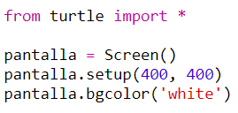
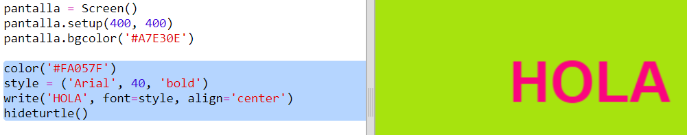

## Uso de códigos de colores hexagonales

La tortuga de Python tiene colores predefinidos tales como 'red' y 'white', sin embargo, también puedes usar códigos de colores hexagonales (es posible que ya hayas visto este tipo de códigos en el curso sobre HTML y CSS). 

+ Abre el Trinket de la plantilla Python en blanco: <a href="http://jumpto.cc/python-new" target="_blank">jumpto.cc/python-new</a>. 

+ Añade el siguiente código de configuración para usar la tortuga:

    
    
    Ten en cuenta que has usado un color con nombre: 'white'.
    
+ La tortuga posee una lista de nombres de colores que puedes usar, sin embargo, seguramente en cierta ocasiones desearás seleccionar tus propios colores. La tortuga también te permite usar códigos de colores hexadecimales. 

  Abre <a href="http://jumpto.cc/colour-picker" target="_blank">jumpto.cc/colour-picker</a> y selecciona el color que desees. Encuentra su código hexadecimal (que comienza con una '#'), como por ejemplo '#A7E30E'.  
  
+ Copia el código hexadecimal, incluyendo la almohadilla marcándolo y, a continuación, haciendo clic derecho y seleccionando Copiar o usando Ctrl-C. 
  
+ A continuación, cambia la línea del código que establece el color de la pantalla para usar tu color. Por ejemplo:

   
   
   Puedes usar clic derecho y Pegar o  Ctrl-V para pegar el código hexadecimal en el trinket. 
  
+ Selecciona otro código de color hexadecimal y úsalo para crear texto a color:

   
   
   No tienes que usar la fuente 'Arial', puedes usar 'Verdana', 'Times' o 'Courier'.
   
   El tamaño de la fuente es '40'. Intenta cambiarlo.  
   
+ Prueba con otros colores hasta que encuentres dos que verdaderamente te gusten juntos. 

