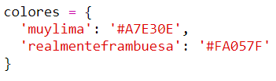
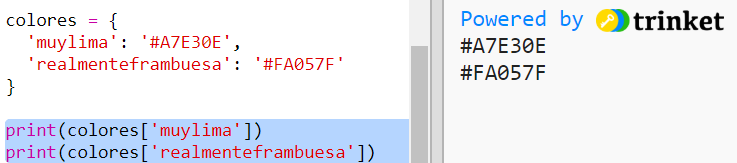

## Un diccionario de colores

Usar códigos de color hexadecimales es realmente flexible pero son difíciles de recordar.

Como probablemente ya sepas, un diccionario te permite buscar una palabra y ver su significado. En Python, un diccionario es aún más flexible que eso: te permite buscar un valor para cualquier 'clave' en el diccionario.

Vamos a crear un diccionario para asignar nombres de colores fáciles para humanos (claves) como códigos hexagonales fáciles para la computadora (valores).

+ Un diccionario está contenido entre llaves.
    
    Crea un diccionario vacío llamado `colores`:
    
    

+ Elige nombres geniales para tus colores y edita la línea `colores =` para añadir entradas al diccionario para ellos.
    
    Aquí hay un ejemplo de un diccionario de color:
    
    
    
    Dos puntos `:` separa la clave (nombre de color) del valor (código hexadecimal). Necesitas una coma `,` entre cada par 'clave:valor' en el diccionario.

+ Ahora no necesitas recordar los códigos hexadecimales, simplemente puedes buscarlos en el diccionario.
    
    Adapta el siguiente código para usar tus nombres de color:
    
    
    
    La clave va dentro de corchetes '[]' después del nombre del diccionario.

+ Ahora puede actualizar su código para buscar colores en el diccionario:
    
    

+ Prueba tu código para asegurarte de que tu texto se muestra correctamente.