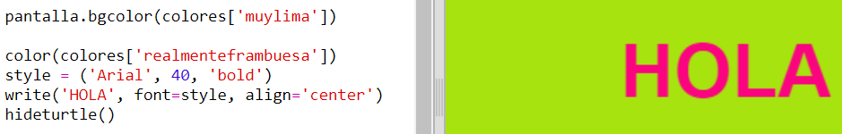

## Un diccionario de colores

Usar códigos de color hexagonales es muy flexible, pero también son difíciles de recordar. 

Como probablemente sepas, un diccionario te permite buscar palabras y consultar su significado. En Python, un diccionario es todavía más flexible. Te permite buscar un valor para cualquier 'key' del diccionario.

Creemos un diccionario que convierta nombres de colores (claves) en códigos hexadecimales (valores).

+ El diccionario debe estar entre llaves. 

  Crea un diccionario vacío denominado `colours`:

   
   
+ Selecciona nombres interesantes para tus colores y edita la línea `colours = {} ` para añadir sus entradas en el diccionario. 

  Aquí tienes un ejemplo del diccionario de colores:

   
   
   Los dos puntos `:` separan las claves (nombres de color) del valor (código hexagonal). Necesitarás una coma `,` entre cada pareja clave:valor del diccionario. 

+ Ahora ya no necesitas recordar los códigos hexadecimales, simplemente búscalos en el diccionario. 

  Adapta el siguiente código para usar tus nombres de color:
  
  
  
  La clave debe situarse dentro de los corchetes '[]', después del nombre del diccionario. 
  
+ Ahora puedes actualizar tu código para busca colores en el diccionario:

  
  
  
+ Prueba tu código para asegurarte de que el texto se visualiza correctamente. 

