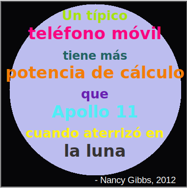

--- challenge ---

## Desafío: crea un póster

Los diseñadores a menudo crean una 'paleta' de colores que funcionan bien juntos para un tema en particular, como el desierto o el espacio.

¿Puedes crear un nuevo proyecto de Python que use un diccionario para crear una paleta de colores temática. Puedes elegir otoño, bosque, mar, Navidad, helados, los colores de tu equipo deportivo favorito o una idea propia.

Crea un póster usando tu diccionario de paleta de colores.

También puede usar otros comandos de tortuga que conozcas, como `forward`, `right`, `left`, `penup` y `pendown`.

¿Quizás podrías agregar un borde a tu póster?

Otros comandos útiles de tortuga:

+ `circle(50)` dibuja un contorno circular con radio 50.
+ `dot(100)` dibuja un círculo relleno con un diámetro de 100. 

Aquí está un ejemplo:

--- /challenge ---

**Traducción aportada por la comunidad**

Este proyecto fue traducido por **Manuel Rodríguez** y revisado por **José María Honrado**.

Nuestros increíbles voluntarios de traducción nos ayudan a dar a los niños de todo el mundo la oportunidad de aprender a programar. Puedes ayudarnos a llegar a más niños traduciendo nuestros proyectos. Consigue más información en [rpf.io/translate](https://rpf.io/translate).