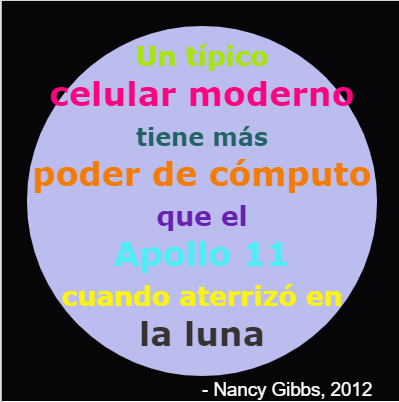

## Introducción

En este proyecto, crearás un diccionario de colores que asigna nombres amigables a los códigos de color que son difíciles de recordar.

  <iframe src="https://trinket.io/embed/python/5b8112ed63?outputOnly=true&start=result" width="600" height="500" frameborder="0" marginwidth="0" marginheight="0" allowfullscreen>
  </iframe>
  

### Información adicional para los líderes del club

Si necesitas imprimir este proyecto, usa la [Versión para imprimir](https://projects.raspberrypi.org/es-LA/projects/colourful-creations/print).

--- collapse ---
---
title: Notas del líder de club
---

## Introducción:

En este proyecto se presentan diccionarios mediante la creación de un diccionario que asigna desde nombres de colores amigables hasta códigos hexadecimales. Los códigos de los colores se buscan en el diccionario y se utilizan para crear un póster colorido.

## Recursos en línea

**Este proyecto utiliza Python 3.** Recomendamos usar [trinket](https://trinket.io/) para escribir Python en línea. Este proyecto contiene los siguientes Trinkets:

* [Principio de 'creaciones coloridas' - jumpto.cc/python-new](http://jumpto.cc/python-new)

También hay un trinket que contiene una solución de muestra a los desafíos:

* ['Creaciones coloreadas' Terminadas -- trinket.io/python/5b8112ed63](https://trinket.io/python/5b8112ed63)

## Recursos sin conexión

Si lo prefieres, este proyecto puede ser [terminado sin tener conexión](https://www.codeclubprojects.org/en-GB/resources/python-working-offline/). Puedes acceder a los recursos del proyecto haciendo clic en el enlace 'Materiales del proyecto'. Este enlace contiene la sección de "Recursos del proyecto", que incluye los recursos que los niños necesitarán para completar este proyecto sin conexión. Asegúrate de que cada niño tenga acceso a una copia de estos recursos. Esta sección incluye los siguientes archivos:

* colourful-creations/colourful-creations.py

También puedes encontrar una versión completa de los desafíos de este proyecto en la sección 'Recursos del líder de Club', que contiene:

* colourful-creations-finished/colourful-creations.py

(Todos los recursos anteriores también se pueden descargar como archivos `.zip` de proyectos y voluntarios.)

## Objetivos de Aprendizaje

* Diccionarios - creando y buscando valores;
* Gráficos de Turtle - texto, fuentes y colores;

Este proyecto incluye elementos de los siguientes aspectos del [Raspberry Pi Digital Making Curriculum](http://rpf.io/curriculum):

* [Usar estructuras de programación básicas para crear programas simples.](https://www.raspberrypi.org/curriculum/programming/creator)

* [Diseño de elementos básicos en 2D y 3D.](https://www.raspberrypi.org/curriculum/design/creator)

## Desafíos

* ¡Más colores! - Utiliza un sitio web de selección de colores para buscar códigos hexadecimales con más colores y agregarlos al diccionario. 
* Crea un póster - Crea un diccionario personalizado de paleta de colores y úsala para crear un póster usando gráficos de Turtle. 

## Preguntas frecuentes

* Es posible que los niños necesiten recordar usar la coma ',' al final de cada entrada del diccionario. 

--- /collapse ---

--- collapse ---
---
title: Materiales del proyecto
---

## Recursos del proyecto

* [El archivo .zip contiene todos los recursos del proyecto](resources/colourful-creations-project-resources.zip)
* [Programa Trinket Python en línea y en blanco](http://jumpto.cc/python-new)
* [Archivo de Python sin conexión y en blanco](resources/new-new.py)

## Recursos del líder del club

* [El archivo .zip contiene todos los recursos del proyecto](resources/colourful-creations-volunteer-resources.zip)
* [Proyecto Trinket terminado en línea](https://trinket.io/python/5b8112ed63)
* [colourful-creations-finished/colourful-creations.py](resources/colourful-creations-finished-colourful-creations.py)

--- /collapse ---