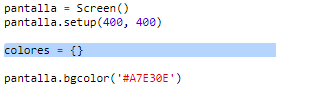
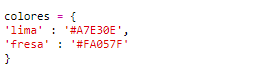
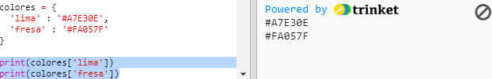
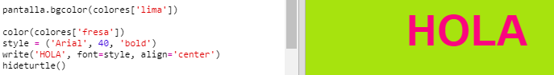

## Un diccionario de colores

Usar códigos de color hexadecimales es realmente flexible, aunque son difíciles de recordar.

Como probablemente ya sepas, un diccionario te permite buscar una palabra y ver su significado. En Python, un diccionario es aún más flexible: te permite buscar un valor para cualquier 'clave' en el diccionario.

Vamos a crear un diccionario para asignar nombres de colores amigables a las personas (claves) hasta códigos hexagonales amigables para la computadora (valores).

+ Un diccionario tiene su contenido entre llaves.
    
    Crea un diccionario vacío llamado `colores`:
    
    

+ Elige nombres geniales para tus colores y edita la línea `colores =` para añadir entradas al diccionario.
    
    He aquí un ejemplo de un diccionario de color:
    
    
    
    Los dos puntos `:` separa la clave (nombre de color) del valor (código hexadecimal). Necesitas una coma `,` entre cada par 'clave:valor' en el diccionario.

+ Ahora no necesitas recordar los códigos hexadecimales, simplemente puedes buscarlos en el diccionario.
    
    Adapta el siguiente código para usar tus nombres de color:
    
    
    
    La clave va dentro de los corchetes '[]' después del nombre del diccionario.

+ Ahora puedes actualizar tu código para buscar los colores en el diccionario:
    
    

+ Prueba tu código para asegurarte de que tu texto permanece mostrándose correctamente.