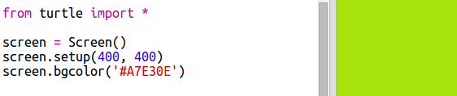

## Käytä heksadesimaaleja

Python-kilpikonna on ennalta määritellyt värit, kuten "punainen" ja "valkoinen", mutta voit myös käyttää heksadesimaaleja (olet ehkä nähnyt nämä HTML & CSS -kurssissa).

+ Avaa tyhjä Python-mallipohja Trinket: <a href="http://jumpto.cc/python-new" target="_blank">jumpto.cc/python-new</a>.

+ Lisää seuraava asetuskoodi kilpikonnien käyttämiseen:
    
    
    
    Huomaa, että käytit nimettyä väriä: "valkoinen".

+ Turtle on luettelo värin nimiä, joita voit käyttää, mutta joskus haluat valita omat värit. Turtle mahdollistaa myös hex-värikoodien käytön.
    
    Avaa <a href="http://jumpto.cc/colour-picker" target="_blank">jumpto.cc/colour-picker</a> ja valitse haluamasi väri. Etsi se kuusikoodi, joka alkaa "#", kuten "# A7E30E".

+ Kopioi hex-koodi, mukaanlukien hash, korostamalla se ja napsauttamalla sitten hiiren kakkospainikkeella Kopiota tai Ctrl-C-näppäintä.

+ Muuta nyt koodin riviä, joka määrittää näytön värin käyttämään väriä. Esimerkiksi:
    
    
    
    Voit napsauttaa hiiren kakkospainikkeella ja Liitä tai Ctrl-V liittääksesi heksadesimaalin koodin rihkamaaseen.

+ Valitse toinen heksadesimaalivärikoodi ja käytä sitä värillisen tekstin luomiseen:
    
    
    
    Sinun ei tarvitse käyttää Arial-fonttia, voit yrittää Verdana, Times tai Courier.
    
    "40" on fonttikoko, voit yrittää muuttaa sitä myös.

+ Kokeile eri värejä, kunnes saat kaksi, jotka todella pitävät siitä hyvältä.