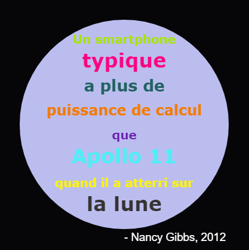

## Introduction

Dans ce projet, tu vas créer un dictionnaire de couleurs qui permettra de lier des codes de couleurs difficiles à mémoriser à des noms bien plus amicaux.

  <iframe src="https://trinket.io/embed/python/97822f48b7?outputOnly=true&start=result" width="600" height="500" frameborder="0" marginwidth="0" marginheight="0" allowfullscreen>
  </iframe>
  

### Informations complémentaires pour les responsables de club

Si vous avez besoin d'imprimer ce projet, vous pouvez utiliser la [ Version imprimable ](https://projects.raspberrypi.org/en/projects/colourful-creations/print).

## \--- collapse \---

## title: Notes pour le responsable de club

## Introduction :

Ce projet introduit les dictionnaires en créant un dictionnaire reliant des noms de couleurs lisibles par un humain à des codes hexa de couleurs. Les codes de couleur sont ensuite recherchés dans le dictionnaire et utilisés pour créer une affiche colorée.

## Ressources en-ligne

**Ce projet utilise Python 3.** Nous recommandons l'utilisation de [Trinket](https://trinket.io/) pour écrire du code Python en-ligne. Ce projet contient les Trinkets suivants :

* ['Créations colorées' point de départ -- jumpto.cc/python-new](http://jumpto.cc/python-new)

Il y a aussi un Trinket contenant un exemple de solution pour les défis :

* [‘Créations colorées’ Terminé -- trinket.io/python/41a99e668b](https://trinket.io/python/97822f48b7)

## Ressources hors-ligne

Ce projet peut être [complété hors-ligne](https://www.codeclubprojects.org/en-GB/resources/python-working-offline/) si désiré. Vous pouvez accéder aux ressources du projet en cliquant sur le lien "Matériel pour projet". Ce lien contient une section "Ressources du projet" qui inclut les ressources dont les enfants auront besoin pour compléter le projet hors-ligne. Assurez-vous que les enfants ont accès à une copie de ces ressources. Cette section inclut les fichiers suivants :

* colourful-creations/colourful-creations.py

You can also find a completed version of this project's challenges in the 'Club leader resources' section, which contains:

* colourful-creations-finished/colourful-creations.py

(Toutes les ressources ci-dessus peuvent aussi être téléchargées dans les fichiers `.zip` projet et bénévole)

## Objectifs d'apprentissage

* Dictionnaires - création et recherche de valeurs;
* Bibliothèque Turtle - texte, fontes et couleurs;

Ce projet couvre les élements suivants du [Programme Raspberry Pi de Créativité Numérique](http://rpf.io/curriculum):

* [Utiliser des constructions basiques de programmation pour élaborer un programme simple.](https://www.raspberrypi.org/curriculum/programming/creator)

* [Concevoir des éléments basiques en 2D et 3D.](https://www.raspberrypi.org/curriculum/design/creator)

## Défis

* Plus de couleurs ! - Utiliser un site web de sélection de couleur pour trouver les codes hexadécimaux pour d'autres couleurs et les ajouter au dictionnaire. 
* Crée une affiche - Créer un dictionnaire de palette de couleurs personnalisée et l'utiliser pour créer une affiche à l'aide de la bibliothèque Turtle. 

## Foire aux questions

* Les enfants peuvent avoir besoin qu'on leur rappelle qu'il faut utiliser une virgule ',' à la fin de chaque entrée du dictionnaire. 

\--- /collapse \---

## \--- collapse \---

## title: Matértiel pour le projet

## Ressources du projet

* [Fichier .zip contenant toutes les ressources du projet](resources/colourful-creations-project-resources.zip)
* [Trinket Python en-ligne vierge](http://jumpto.cc/python-new)
* [Fichier Python hors-ligne vierge](resources/new-new.py)

## Ressources pour le responsable de club

* [Fichier .zip contenant toutes les ressources du projet](resources/colourful-creations-volunteer-resources.zip)
* [Trinket Python en-ligne vierge](https://trinket.io/python/97822f48b7)
* [colourful-creations-finished/colourful-creations.py](resources/colourful-creations-finished-colourful-creations.py)

\--- /collapse \---