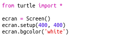
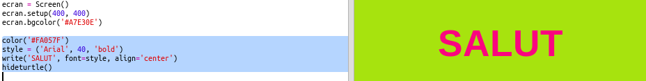

## Utilisation des codes hexadécimaux de couleurs

La bibliothèque turtle de Python a des couleurs prédéfinies comme 'red' ou 'white' (rouge ou blanc) mais tu peux aussi utiliser des codes hexadécimaux de couleurs (tu as pu apercevoir ces codes dans le cours HTML & CSS.)

+ Ouvre le modèle de Trinket Python vierge : <a href="http://jumpto.cc/python-new" target="_blank">jumpto.cc/python-new</a>.

+ Ajoutes le code suivant pour utiliser les tortues de la bibliothèque turtle :
    
    
    
    Note que tu utilises une couleur nommée : 'white' (blanc).

+ La bibliothèque turtle possède une liste de noms de couleurs que tu peux utiliser, mais parfois tu veux pouvoir choisir tes propres couleurs. La bibliothèque turtle t'autorise aussi à utiliser des codes hexadécimaux de couleurs.
    
    Ouvre <a href="http://jumpto.cc/colour-picker" target="_blank">jumpto.cc/colour-picker</a> et choisis une couleur que tu aimes. Trouve son code hexa qui commence par un '#', comme par exemple '#A7E30E'.

+ Copies le code hexa, en incluant le dièse, en le surlignant puis en cliquant le bouton droit, pour choisir "Copier", ou alors utilises Ctrl+C.

+ Maintenant, changes la ligne de code qui définit la couleur de l'écran. Par exemple :
    
    
    
    Tu peux utiliser le clic droit puis "Coller" ou bien Ctrl+V pour coller le code hexa dans trinket.

+ Choisis un autre code hexa de couleur et utilises le pour la couleur du texte :
    
    
    
    Tu n'es pas obligé d'utiliser la fonte 'Arial', tu peux essayer 'Verdana', 'Times' ou 'Courier'.
    
    '40' est la taille de la fonte, tu peux essayer de modifier ça aussi.

+ Essaies différentes couleurs jusqu'à ce que tu en obtiennes deux que tu aimes vraiment et qui vont bien ensemble.