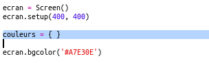
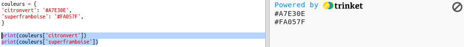
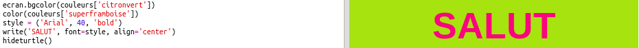

## Un dictionnaire de couleurs

Utiliser les codes hexa de couleurs est très souple, mais ils sont difficiles à mémoriser.

Comme vous le savez peut être déjà, un dictionnaire permet de chercher un mot, vous permettant de connaître sa signification. En Python, un dictionnaire est encore plus souple que ça : il te permet de chercher une valeur pour n'importe quelle "clé" du dictionnaire.

Créons un dictionnaire pour relier des noms plus lisibles pour un humain (nos clés) aux codes hexa de couleurs comprises par l'ordinateur.

+ Un dictionnaire est défini par des accolades.
    
    Crée un dictionnaire vide appelé `couleurs` :
    
    

+ Choisis des noms cools pour tes couleurs et édite la ligne `couleurs = {}` pour ajouter les entrées correspondantes à ton dictionnaire.
    
    Voici un exemple de dictionnaire de couleurs :
    
    
    
    Deux points `:` séparent la clé (le nom de la couleur) de sa valeur (code hexa). Tu as besoin d'une virgule `,` entre chaque paire clé:valeur dans le dictionnaire.

+ Maintenant, tu n'as plus besoin de te rappeler les codes hexa de couleurs, tu peux simplement les retrouver grâce au dictionnaire.
    
    Modifie le code suivant pour utiliser tes noms de couleurs :
    
    
    
    La clé va entre les crochets '[]' après le nom du dictionnaire.

+ Maintenant, tu peux mettre à jour ton code pour rechercher les couleurs dans ton dictionnaire :
    
    

+ Teste ton code pour être sûr que ton texte s'affiche toujours correctement.