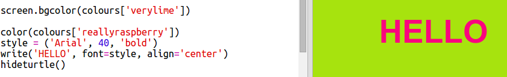

## कलर डिक्शनरी

हेक्स रंग कोड का उपयोग करना वास्तव में लचीला है लेकिन उन्हें याद रखना मुश्किल है।

जैसा कि आप शायद पहले से ही जानते हैं, एक शब्दकोश आपको एक शब्द देखने और इसका अर्थ देखने की अनुमति देता है। पायथन में, एक शब्दकोश और भी अधिक लचीला है कि - यह आपको शब्दकोश में किसी भी 'कुंजी' के लिए एक मूल्य देखने की अनुमति देता है।

आइए मानव-अनुकूल रंग नामों (कुंजियों) से कंप्यूटर-अनुकूल हेक्स कोड (मान) तक मानचित्र बनाने के लिए एक शब्दकोश बनाएं।

+ एक शब्दकोश घुंघराले कोष्ठक में निहित है।
    
    एक खाली शब्दकोश बनाएं जिसे ` colours`:
    
    

+ अपने रंगों के लिए शांत नाम चुनें और ` colours = ` संपादित करें शब्दकोश में प्रविष्टियों को जोड़ने के लिए
    
    यहाँ एक उदाहरण रंग शब्दकोश है:
    
    
    
    एक बृहदान्त्र `: ` मूल्य (हेक्स कोड) से कुंजी (रंग नाम) को अलग करता है। आपको अल्पविराम `,` की आवश्यकता है प्रत्येक कुंजी:शब्दकोश के बीच में मूल्य जोड़ी।

+ अब आपको हेक्स कोड याद रखने की आवश्यकता नहीं है, आप उन्हें केवल शब्दकोश में देख सकते हैं।
    
    अपने रंग नामों का उपयोग करने के लिए निम्नलिखित कोड अपनाएं:
    
    
    
    शब्दकोश के नाम के बाद, वर्ग कोष्ठक '[]' के अंदर चला जाता है।

+ अब आप शब्दकोश में रंग देखने के लिए अपना कोड अपडेट कर सकते हैं:
    
    

+ यह सुनिश्चित करने के लिए कि आपका पाठ अभी भी सही ढंग से प्रदर्शित हो रहा है, अपने कोड का परीक्षण करें।