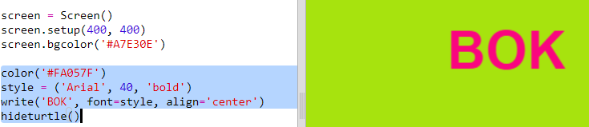

## Korištenje hex kôdova boja

Python turtle sadrži unaprijed definirane boje poput 'red' (crvene) i 'white' (bijele), ali možeš se koristiti i hex kôdovima boja (s njima si se možda već upoznao tijekom HTML & CSS tečaja.)

+ Otvori prazan Python predložak u Trinketu: <a href="http://jumpto.cc/python-new" target="_blank">jumpto.cc/python-new</a>.

+ Dodaj sljedeći kôd za pokretanje Python turtle okruženja za rad:
    
    
    
    Primijeti da si koristio ime boje: 'white' (bijela).

+ Turtle sadrži listu imena boja koje možeš koristiti, ali ponekad želiš odabrati vlastite boje. Turtle ti dopušta i korištenje hex kôdova boja.
    
    Otvori <a href="http://jumpto.cc/colour-picker" target="_blank">jumpto.cc/colour-picker</a> i odaberi boju koja ti se sviđa. Pronađi njen hex kôd koji počinje znakom '#', kao na primjer '#A7E30E'.

+ Označi hex kôd, zajedno sa znakom ljestvi, kako bi ga mogao kopirati. Zatim klikni na kôd desnom tipkom miša i odaberi Copy (Kopiraj). Kôd možeš kopirati i tako da ga označiš, a zatim pritisneš tipke Ctrl i C.

+ Sada izmijeni liniju kôda u kojoj je podešena boja ekrana tako da koristiš svoju boju. Na primjer:
    
    
    
    Da bi zalijepio svoj hex kôd u trinket koristi desnu tipku miša i opciju Paste (Zalijepi) ili kombinaciju tipki Ctrl i V.

+ Odaberi novi hex kôd za boju i upotrijebi ga da obojaš tekst:
    
    
    
    Ne moraš koristiti font slova 'Arial'. Isprobaj, primjerice, fontove 'Verdana', 'Times' ili 'Courier'.
    
    '40' označava veličinu slova. Možeš pokušati i to izmijeniti.

+ Isprobaj različite boje dok ne pronađeš dvije koje ti se sviđaju.