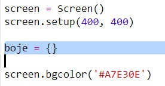
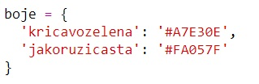
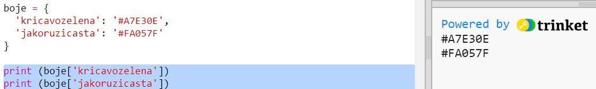
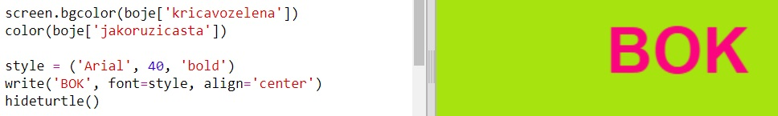

## Rječnik boja

Korištenje hex kôdova boja je vrlo jednostavno, ali ih je teško zapamtiti.

Kao što vjerojatno već znaš, u rječniku možeš pronaći riječ i vidjeti njeno značenje. U Pythonu je rječnik još jednostavniji - omogućava ti da pogledaš vrijednost bilo kojeg 'ključa' koji se u njemu nalazi.

Napravimo rječnik koji će povezivati jednostavna imena boja (ključeve) sa njihovim hex kôdovima (vrijednostima).

+ Sadržaj rječnika pišemo unutar vitičastih zagrada.
    
    Napravi prazan rječnik i nazovi ga `boje`:
    
    

+ Odaberi zanimljiva imena za svoje boje i izmijeni liniju kôda gdje piše `boje =` kako bi dodao svoje boje u rječnik.
    
    Pogledaj primjer rječnika boja:
    
    
    
    Znak dvotočja `:` odvaja ključ (naziv boje) od vrijednosti (hex kôd.) Između svakog ključ:vrijednost para u rječniku mora biti zarez `,`.

+ Sada ne moraš pamtiti hex kôdove, već ih jednostavno možeš potražiti u rječniku.
    
    Prilagodi sljedeći kôd tako da program koristi tvoje nazive za boje:
    
    
    
    Ključ pišemo unutar uglatih zagrada '[]' i nakon naziva rječnika.

+ Sada možeš izmijeniti svoj kôd tako da pretražuje boje u rječniku:
    
    

+ Testiraj kôd kako bi bio siguran da se tvoj tekst još uvijek prikazuje kako treba.