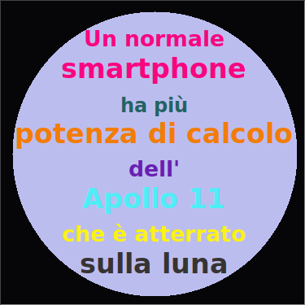

## Introduzione

In questo progetto creerai un dizionario di colori che mappa i codici dei colori (difficilissimi da ricordare) con dei nomi più descrittivi.

  <iframe src="https://trinket.io/embed/python/97822f48b7?outputOnly=true&start=result" width="600" height="500" frameborder="0" marginwidth="0" marginheight="0" allowfullscreen>
  </iframe>
  

### Ulteriori informazioni per gli organizzatori dei club

Se intendete stampare questo progetto, cliccate su [Versione stampabile](https://projects.raspberrypi.org/en/projects/colourful-creations/print).

## \--- collapse \---

## title: Note per i volontari

## Introduzione:

Questo progetto introduce i dizionari creandone uno che mappa i nomi dei colori, più facili da ricordare, ai corrispondenti codici esadecimali. I codici dei colori sono quindi cercati nel dizionario e utilizzati per creare un poster coloratissimo.

## Risorse online

**Questo progetto utilizza Python 3.** Consigliamo di utilizzare [trinket](https://trinket.io/) per scrivere in linguaggio Python online. Questo progetto contiene i seguenti Trinket:

* [Punto di partenza per "Creazioni colorate" - jumpto.cc/python-new](http://jumpto.cc/python-new)

È disponibile anche un trinket con esempi di soluzioni alle sfide:

* ["Creazioni colorate" completato - trinket.io/python/41a99e668b](https://trinket.io/python/97822f48b7)

## Risorse offline

Questo progetto può anche essere [completato offline](https://www.codeclubprojects.org/en-GB/resources/python-working-offline/). È possibile accedere alle risorse del progetto facendo click sul link "Materiali del progetto" relativo a questo progetto. Alla sezione "Risorse del progetto", sono raccolte le risorse necessarie ai bambini per completare il progetto offline. È bene assicurarsi che tutti i bambini abbiano accesso a una copia di queste risorse. Questa sezione contiene i seguenti file:

* colourful-creations/colourful-creations.py

Una versione completa delle sfide di questo progetto è presente anche nella sezione “Risorse per i volontari”, che contiene:

* colourful-creations-finished/colourful-creations.py

(Tutte le risorse sopra indicate possono essere scaricate anche come file `.zip` di progetto e di volontario)

## Obiettivi di apprendimento

* Dizionari - creazione e ricerca dei valori;
* Geometria della tartaruga - testo, caratteri e colori;

Questo progetto include elementi tratti dalle seguenti componenti del [Raspberry Pi Digital Making Curriculum](http://rpf.io/curriculum):

* [Utilizzo di costrutti base di un linguaggio di programmazione per creare programmi semplici.](https://www.raspberrypi.org/curriculum/programming/creator)

* [Progettazione di elementi 2D e 3D semplici.](https://www.raspberrypi.org/curriculum/design/creator)

## Sfide

* Altri colori! Utilizza un sito web di selezione dei colori per scoprire nuovi codici esadecimali e aggiungerli al dizionario. 
* Crea un poster. Crea un dizionario e una tavolozza di colori personalizzata da usare per creare un poster con la geometria della Tartaruga. 

## Domande frequenti

* Potrebbe essere necessario ricordare ai bambini di inserire una ","(virgola) alla fine di ciascuna voce del dizionario. 

\--- /collapse \---

## \--- collapse \---

## title: Materiali del progetto

## Risorse del progetto

* [File .zip con tutte le risorse del progetto](resources/colourful-creations-project-resources.zip)
* [Trinket online vuoto per Python](http://jumpto.cc/python-new)
* [File offline vuoto per Python](resources/new-new.py)

## Risorse per i volontari

* [File .zip con tutte le risorse del progetto](resources/colourful-creations-volunteer-resources.zip)
* [Trinket online completato](https://trinket.io/python/97822f48b7)
* [colourful-creations-finished/colourful-creations.py](resources/colourful-creations-finished-colourful-creations.py)

\--- /collapse \---