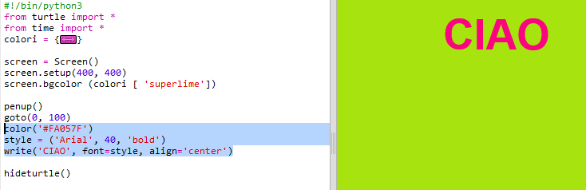

## Come usare i codici esadecimali dei colori

La tartaruga di Python ha dei colori predefiniti, come "rosso" e "bianco", ma puoi usare codici esadecimali dei colori (li hai probabilmente già visti nel corso HTML & CSS.)

+ Apri un modello vuoto di Python su Trinket: <a href="http://jumpto.cc/python-new" target="_blank">jumpto.cc/python-new</a>.

+ Aggiungi il seguente codice di inizializzazione per usare la tartaruga:
    
    
    
    Hai usato un colore con un nome già assegnato: "white" (bianco).

+ La tartaruga contiene già un elenco di nomi di colori che puoi usare, ma talvolta potresti voler scegliere dei colori personali. La tartaruga ti consente di usare i codici esadecimali dei colori.
    
    Apri <a href="http://jumpto.cc/colour-picker" target="_blank">jumpto.cc/colour-picker</a> e scegli un colore che ti piace. Trova il suo codice esadecimale, che comincia con “#”, ad esempio “#A7E30E”.

+ Copia il codice esadecimale evidenziandolo, compreso il cancelletto, premendo il tasto destro del mouse e quindi scegliendo Copia oppure premendo Ctrl-C.

+ Adesso cambia la linea di codice che imposta il colore dello schermo, per usare quello che hai scelto. Ad esempio:
    
    
    
    Per incollare il tuo codice esadecimale in Trinket puoi premere il tasto destro del mouse e scegliere Incolla, oppure puoi premere Ctrl+V.

+ Scegli un altro codice esadecimale di colore e usalo per creare del testo colorato:
    
    
    
    Non sei obbligato a usare il font “Arial”. Puoi scegliere “Verdana”, “Times” o “Courier”.
    
    “40” indica le dimensioni del font. Se vuoi puoi cambiare anche questo.

+ Prova a usare colori diversi fino a trovarne due che stanno davvero bene insieme.