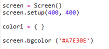
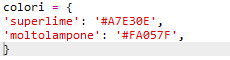
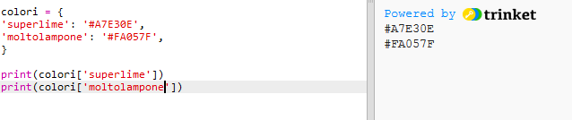

## Un dizionario di colori

I codici esadecimali dei colori sono molto utili, ma sono difficili da ricordare.

Come certamente sai, un dizionario ti consente di cercare una parola e vedere cosa vuol dire. In Python, un dizionario è persino più potente. Ti permette di cercare un valore per ogni "chiave" contenuta nel dizionario.

Creiamo adesso un dizionario per mappare la corrispondenza fra i normali nomi dei colori che capiscono le persone (chiavi) e il codici esadecimali (valori) che capiscono i computer.

+ I dizionari sono contenuti fra parentesi graffe.

  Crea un dizionario vuoto chiamato "colours" (colori):

   

+ Scegli dei nomi carinissimi per i tuoi colori e modifica la riga "colours = {}" per aggiungere le corrispondenti voci al dizionario.

  Questo è un esempio di dizionario di colori:

   

   I due punti (:) separano la chiave (nome del colore) dal valore (codice esadecimale). Nel dizionario, ogni coppia chiave:valore deve essere separata dalle altre con una virgola (,).

+ Adesso non è più necessario ricordare i codici esadecimali: puoi semplicemente cercarli nel dizionario.

  Adatta il seguente codice per usare i tuoi nomi di colori:

  

  La chiave va fra le parentesi quadre "[]" dopo il nome del dizionario.

+ Adesso puoi aggiornare il codice per fargli cercare i colori nel dizionario.

  

+ Prova il codice per controllare che il testo venga visualizzato ancora correttamente.

