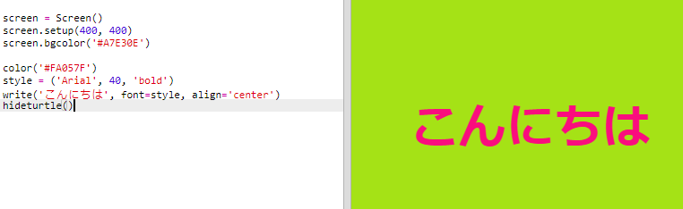

## ヘックス・カラー・コードを使おう

Pythonタートルには事前に定義された赤や白の色があるが、ヘックス・カラー・コードを使用することも可能である。

+ Pythonの空白テンプレートを開き：<a href="http://jumpto.cc/python-new" target="_blank">jumpto.cc/python-new</a>

+ タートルを使うための次の設定コードを追加する：
    
    
    
    色の名称”white”(白)を使用したことに注目してください。

+ タートルには利用可能な色のリストがありますが、時には自分で選んだ色を使いたい時もあります。 タートルはこの場合、ヘックス・カラー・コードの利用が可能です。
    
    <a href="http://jumpto.cc/colour-picker" target="_blank">jumpto.cc/colour-picker</a> を開き、使用したい色を選択する。 それぞれの#で始まるヘックス・コードを探してください。例えば、#A7E30E。

+ ヘックス・コードを#を含む状態でハイライトし、右クリックでコピーを選択してコピーしてください。それかCtrl-Cでコピー。

+ これで画面上の色を設定するコードを変更してください。 例えば:
    
    
    
    右クリックで貼り付けかCtrl-Vでtrinketにヘックスコードを貼り付けることができます。

+ 別のヘックス・カラー・コードを選び、色が付いたテキストを作ろう。
    
    
    
    Arialフォントを使用する必要はない、Verdana, TimesかCourierを試しても問題ない。
    
    フォント・サイズも40に設定されているが、それを変更することも可能。

+ 様々な色を試し、自分が好きな2つの色の組み合わせができるまで試そう。