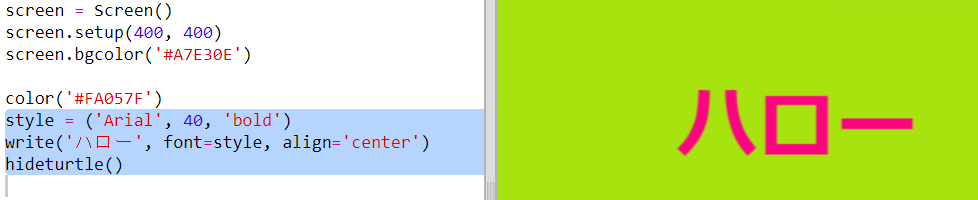

## 16進カラーコードを使おう

Python turtleは事前に定義された赤や白の色がありますが、16進カラーコード(あなたはこれらをHTML & CSSコースで見たことがあるかもしれません) を使用することも可能です。

+ 空のPythonテンプレートTrinketを開く: <a href="http://jumpto.cc/python-new" target="_blank">jumpto.cc/python-new</a>

+ 次のセットアップコードをturtleを使うために追加する:
    
    
    
    名前のついた色を使用する際の注意: 'white'

+ 利用可能な色の名前のリストがturtleにはありますが、自分で選んだ色を使いたい時もあります。 16進カラーコードをturtleは利用することも可能です。
    
    <a href="http://jumpto.cc/colour-picker" target="_blank">jumpto.cc/colour-picker</a> を開き、好きな色を選択する。 '#A7E30E'のように'#'で始まる16進コードを探してください。

+ ハッシュを含む16進コードをコピーするには、ハイライトし、右クリックでコピーを選択、またはCtrl-Cでコピーしてください。

+ 次に、画面の色を設定するコードの行を変更して、あなたの色を使用します。 例えば:
    
    
    
    右クリックまたはCtrl-Vでにより、trinketに16進コードを貼り付けることができます。

+ 別の16進カラーコードを選び、それを使って色が付いた文章を作ろう:
    
    
    
    'Arial'フォントを使用する必要はなく、'Verdana', 'Times'または'Courier'を試しても問題ないです。
    
    '40'はフォントサイズです、それも変更してみてください。

+ 様々な色を試し、自分が好きな組み合わせの2つの色を決めましょう。