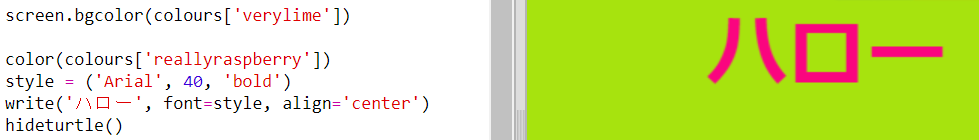

## 色の辞書

16進カラーコードを使用することは本当に柔軟ですが、覚えにくいです。

もうすでにご存じだと思うが、辞書により言葉で検索して、その意味することを見ることができます。 Pythonの辞書はそれよりさらに柔軟です - 辞書にあるいかなる'キー'に対しても値を調べることが可能です。

人に分かりやすい色の名前(キー) とコンピューター向けの16進コード(値) を結びつける辞書を作ってみよう。

+ 辞書は中括弧で囲まれています。
    
    `colours`のという名前の空の辞書を作りましょう:
    
    

+ かっこいい色の名前を選び、`colours =`行を編集し、それらを辞書の要素に追加します。
    
    これが色の辞書の例です:
    
    
    
    コロン`:` はキー(色の名前)と値(16進コード)を分けます。辞書の中の各キー:値のペアの間にはカンマ`,` が必要です。

+ これで、16進コードを覚える必要がなく、辞書で検索すればいいようになりました。
    
    色の名前を使用するために次のコードを当てはめます:
    
    
    
    辞書の名前の後にある角括弧'[]'の中にキーは入ります。

+ コードを更新して、辞書の中で色を検索できるようになりました。
    
    

+ コードをテストして、文章が正しく表示されることを確認します。