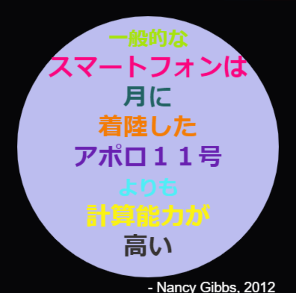

\--- challenge \---

## チャレンジ：ポスターを作ろう

デザイナーの多くは色のパレットを作り、砂漠や宇宙など特定のテーマに使えるものを作る。

Pythonの新しいプロジェクトとしてテーマ用の色パレットを作れるかな？ 秋、森、海、クリスマス、アイスクリーム、自分の一番好きなスポーツチームなど自分のアイディアをもとにテーマを選ぼう。

色パレットのディクショナリを使ってポスターを作ろう。

`forward`、`right`、 `left`、 `penup`、 `pendown`　などすでに知っている他のタートルコマンドを使用することも可能。 

ポスターに境界を付けるのもいいかもしれない。

他に便利なタートル・コマンドは：

+ `circle(50)`　半径50の丸のアウトラインを描く。
+ `dot(100)` 　塗りつぶしされた直径100の丸を描く。 

例示します:

\--- /challenge \---