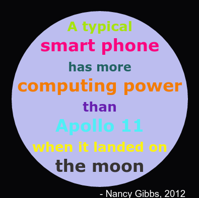

## ಪರಿಚಯ

ಈ ಯೋಜನೆಯಲ್ಲಿ ನೀವು ಬಣ್ಣಗಳ ನಿಘಂಟನ್ನು ರಚಿಸುವಿರಿ ಅದು ಬಣ್ಣ ಸಂಕೇತಗಳನ್ನು ಸ್ನೇಹಪರ ಹೆಸರುಗಳಾಗಿ ನೆನಪಿಟ್ಟುಕೊಳ್ಳಲು ಕಷ್ಟವಾಗುತ್ತದೆ.

  <iframe src="https://trinket.io/embed/python/97822f48b7?outputOnly=true&start=result" width="600" height="500" frameborder="0" marginwidth="0" marginheight="0" allowfullscreen>
  </iframe>
  

### ಕ್ಲಬ್ ಮುಖಂಡರಿಗೆ ಹೆಚ್ಚುವರಿ ಮಾಹಿತಿ

ನೀವು ಈ ಯೋಜನೆಯನ್ನು ಮುದ್ರಿಸಬೇಕಾದರೆ, ದಯವಿಟ್ಟು [ಪ್ರಿಂಟರ್ ಸ್ನೇಹಿ ಆವೃತ್ತಿ](https://projects.raspberrypi.org/kn-IN/projects/colourful-creations/print) ಅನ್ನು ಬಳಸಿ.

--- collapse ---
---
title: ಕ್ಲಬ್ ನಾಯಕ ಟಿಪ್ಪಣಿಗಳು
---

## ಪರಿಚಯ:

ಈ ಯೋಜನೆಯು ಮಾನವ ಸ್ನೇಹಿ ಬಣ್ಣದ ಹೆಸರುಗಳಿಂದ ಹೆಕ್ಸ್ ಕೋಡ್‌ಗಳಿಗೆ ನಕ್ಷೆ ಮಾಡುವ ನಿಘಂಟನ್ನು ರಚಿಸುವ ಮೂಲಕ ನಿಘಂಟುಗಳನ್ನು ಪರಿಚಯಿಸುತ್ತದೆ. ನಂತರ ಬಣ್ಣ ಸಂಕೇತಗಳನ್ನು ನಿಘಂಟಿನಲ್ಲಿ ನೋಡಲಾಗುತ್ತದೆ ಮತ್ತು ವರ್ಣರಂಜಿತ ಪೋಸ್ಟರ್ ರಚಿಸಲು ಬಳಸಲಾಗುತ್ತದೆ.

## ಆನ್‌ಲೈನ್ ಸಂಪನ್ಮೂಲಗಳು

**ಈ ಯೋಜನೆಯು Python 3 ಬಳಸುತ್ತದೆ.** ನೀವು Python ಆನ್‌ಲೈನ್‌ನಲ್ಲಿ ಬರೆಯಲು ನಾವು [trinket](https://trinket.io/) ಬಳಸಲು ಶಿಫಾರಸು ಮಾಡಿದ್ದೇವೆ. ಈ ಯೋಜನೆಯು ಈ ಕೆಳಗಿನ Trinkets ಒಳಗೊಂಡಿದೆ:

* ['ವರ್ಣರಂಜಿತ ಸೃಷ್ಟಿಗಳು' ಪ್ರಾರಂಭದ ಹಂತ -- jumpto.cc/python-new](http://jumpto.cc/python-new)

ಸವಾಲುಗಳಿಗೆ ಮಾದರಿ ಪರಿಹಾರವನ್ನು ಒಳಗೊಂಡಿರುವ trinket ಸಹ ಇದೆ:

* [‘ವರ್ಣರಂಜಿತ ಸೃಷ್ಟಿಗಳು’ ಮುಗಿದಿದೆ -- trinket.io/python/41a99e668b](https://trinket.io/python/97822f48b7)

## ಆಫ್‌ಲೈನ್ ಸಂಪನ್ಮೂಲಗಳು

ಬಯಸಿದರೆ ಈ ಯೋಜನೆಯನ್ನು [ಆಫ್‌ಲೈನ್‌ನಲ್ಲಿ ಪೂರ್ಣಗೊಳಿಸಬಹುದು](https://www.codeclubprojects.org/en-GB/resources/python-working-offline/). ಈ ಯೋಜನೆಗಾಗಿ 'ಯೋಜನೆ ವಸ್ತುಗಳು' ಲಿಂಕ್ ಕ್ಲಿಕ್ ಮಾಡುವ ಮೂಲಕ ನೀವು ಪ್ರಾಜೆಕ್ಟ್ ಸಂಪನ್ಮೂಲಗಳನ್ನು ಪಡೆಯಬಹುದು. ಈ ಲಿಂಕ್ 'ಯೋಜನೆ ಸಂಪನ್ಮೂಲಗಳು' ವಿಭಾಗವನ್ನು ಒಳಗೊಂಡಿದೆ, ಇದರಲ್ಲಿ ಮಕ್ಕಳು ಈ ಯೋಜನೆಯನ್ನು ಆಫ್‌ಲೈನ್‌ನಲ್ಲಿ ಪೂರ್ಣಗೊಳಿಸಬೇಕಾದ ಸಂಪನ್ಮೂಲಗಳನ್ನು ಒಳಗೊಂಡಿದೆ. ಈ ಸಂಪನ್ಮೂಲಗಳ ಪ್ರತಿಕೃತಿಗೆ ಪ್ರತಿ ಮಗುವಿಗೆ ಪ್ರವೇಶವಿದೆ ಎಂದು ಖಚಿತಪಡಿಸಿಕೊಳ್ಳಿ. ಈ ವಿಭಾಗವು ಈ ಕೆಳಗಿನ ಫೈಲ್‌ಗಳನ್ನು ಒಳಗೊಂಡಿದೆ:

* colourful-creations/colourful-creations.py

ಈ ಯೋಜನೆಯ ಸವಾಲುಗಳ ಪೂರ್ಣಗೊಂಡ ಆವೃತ್ತಿಯನ್ನು 'ಕ್ಲಬ್ ಲೀಡರ್ ಸಂಪನ್ಮೂಲಗಳು' ವಿಭಾಗದಲ್ಲಿ ನೀವು ಕಾಣಬಹುದು, ಇದರಲ್ಲಿ:

* colourful-creations-finished/colourful-creations.py

(ಮೇಲಿನ ಎಲ್ಲಾ ಸಂಪನ್ಮೂಲಗಳನ್ನು ಯೋಜನೆ ಮತ್ತು ಸ್ವಯಂಸೇವಕ `.zip` ಫೈಲ್‌ಗಳಂತೆ ಡೌನ್‌ಲೋಡ್ ಮಾಡಬಹುದು.)

## ಕಲಿಕೆ ಉದ್ದೇಶಗಳು

* ನಿಘಂಟುಗಳು - ಮೌಲ್ಯಗಳನ್ನು ರಚಿಸುವುದು ಮತ್ತು ಹುಡುಕುವುದು;
* Turtle ಗ್ರಾಫಿಕ್ಸ್ - ಪಠ್ಯ, ಫಾಂಟ್‌ಗಳು ಮತ್ತು ಬಣ್ಣಗಳು;

ಈ ಯೋಜನೆ [Raspberry Pi Digital Making Curriculum](http://rpf.io/curriculum) ಇದರ ಪಠ್ಯಕ್ರಮವನ್ನು ಅನುಸರಿಸುತ್ತದೆ:

* [ಸರಳ ಕಾರ್ಯಕ್ರಮಗಳನ್ನು ರಚಿಸಲು ಮೂಲ ಪ್ರೋಗ್ರಾಮಿಂಗ್ ರಚನೆಗಳನ್ನು ಬಳಸಿ.](https://www.raspberrypi.org/curriculum/programming/creator)

* [ಮೂಲ 2ಡಿ ಮತ್ತು 3ಡಿ ಸ್ವತ್ತುಗಳನ್ನು ವಿನ್ಯಾಸಗೊಳಿಸಿ.](https://www.raspberrypi.org/curriculum/design/creator)

## ಸವಾಲುಗಳು

* ಇನ್ನಷ್ಟು ಬಣ್ಣಗಳು! - ಹೆಚ್ಚಿನ ಬಣ್ಣಗಳಿಗಾಗಿ ಹೆಕ್ಸ್‌ಕೋಡ್‌ಗಳನ್ನು ಹುಡುಕಲು ಮತ್ತು ಅವುಗಳನ್ನು ನಿಘಂಟಿಗೆ ಸೇರಿಸಲು ಬಣ್ಣ ಪಿಕ್ಕರ್ ವೆಬ್‌ಸೈಟ್ ಬಳಸಿ. 
* ಪೋಸ್ಟರ್ ರಚಿಸಿ - ಕಸ್ಟಮ್ ಬಣ್ಣದ ಪ್ಯಾಲೆಟ್ ನಿಘಂಟನ್ನು ರಚಿಸಿ ಮತ್ತು Turtle ಗ್ರಾಫಿಕ್ಸ್ ಬಳಸಿ ಪೋಸ್ಟರ್ ರಚಿಸಲು ಅದನ್ನು ಬಳಸಿ. 

## ಪದೇ ಪದೇ ಕೇಳಲಾಗುವ ಪ್ರಶ್ನೆಗಳು

* ಪ್ರತಿ ನಿಘಂಟು ಪ್ರವೇಶದ ಕೊನೆಯಲ್ಲಿ ಮಕ್ಕಳಿಗೆ ಅಲ್ಪವಿರಾಮ ',' ಬಗ್ಗೆ ನೆನಪಿಸುವ ಅಗತ್ಯವಿರಬಹುದು. 

--- /collapse ---

--- collapse ---
---
title: ಯೋಜನೆಯ ವಸ್ತುಗಳು
---

## ಯೋಜನೆಯ ಸಂಪನ್ಮೂಲಗಳು

* [ಎಲ್ಲಾ ಯೋಜನೆಯ ಸಂಪನ್ಮೂಲಗಳನ್ನು ಹೊಂದಿರುವ .zip ಫೈಲ್](resources/colourful-creations-project-resources.zip)
* [ಆನ್‌ಲೈನ್ ಖಾಲಿ Python Trinket](http://jumpto.cc/python-new)
* [ಆಫ್‌ಲೈನ್ ಖಾಲಿ Python ಫೈಲ್](resources/new-new.py)

## ಕ್ಲಬ್ ನಾಯಕ ಸಂಪನ್ಮೂಲಗಳು

* [ಪೂರ್ಣಗೊಂಡ ಎಲ್ಲಾ ಯೋಜನೆಯ ಸಂಪನ್ಮೂಲಗಳನ್ನು ಹೊಂದಿರುವ .zip ಫೈಲ್](resources/colourful-creations-volunteer-resources.zip)
* [ಆನ್‌ಲೈನ್ ಪೂರ್ಣಗೊಂಡ Trinket ಯೋಜನೆ](https://trinket.io/python/97822f48b7)
* [colourful-creations-finished/colourful-creations.py](resources/colourful-creations-finished-colourful-creations.py)

--- /collapse ---