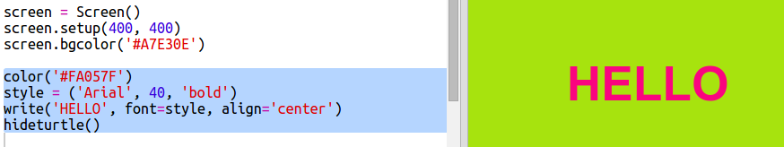

## ಹೆಕ್ಸ್ ಬಣ್ಣ ಸಂಕೇತಗಳನ್ನು ಬಳಸುವುದು

Python turtle 'ಕೆಂಪು' ಮತ್ತು 'ಬಿಳಿ' ನಂತಹ ಪೂರ್ವನಿರ್ಧರಿತ ಬಣ್ಣಗಳನ್ನು ಹೊಂದಿದೆ, ಆದರೆ ನೀವು ಹೆಕ್ಸ್ ಬಣ್ಣ ಸಂಕೇತಗಳನ್ನು ಸಹ ಬಳಸಬಹುದು (ನೀವು ಇವುಗಳನ್ನು HTML & CSS ಕೋರ್ಸ್‌ನಲ್ಲಿ ನೋಡಿರಬಹುದು.)

+ ಖಾಲಿ Python template Trinket ಅನ್ನು ತೆರೆಯಿರಿ: <a href="http://jumpto.cc/python-new" target="_blank">jumpto.cc/python-new </a>.

+ Turtle ಬಳಸಲು ಈ ಕೆಳಗಿನ ಸೆಟಪ್ ಕೋಡ್ ಸೇರಿಸಿ:
    
    
    
    ನೀವು ಹೆಸರಿಸಿದ ಬಣ್ಣವನ್ನು ಬಳಸಿದ್ದೀರಿ ಎಂಬುದನ್ನು ಗಮನಿಸಿ: 'ಬಿಳಿ'.

+ Turtle ನೀವು ಬಳಸಬಹುದಾದ ಬಣ್ಣದ ಹೆಸರುಗಳ ಪಟ್ಟಿಯನ್ನು ಹೊಂದಿದೆ, ಆದರೆ ಕೆಲವೊಮ್ಮೆ ನೀವು ನಿಮ್ಮ ಸ್ವಂತ ಬಣ್ಣಗಳನ್ನು ಆಯ್ಕೆ ಮಾಡಲು ಬಯಸುತ್ತೀರಿ. Turtle ನಿಮಗೆ ಹೆಕ್ಸ್ ಬಣ್ಣ ಸಂಕೇತಗಳನ್ನು ಬಳಸಲು ಅನುಮತಿಸುತ್ತದೆ.
    
    <a href="http://jumpto.cc/colour-picker" target="_blank">jumpto.cc/colour-picker</a> ತೆರೆಯಿರಿ ಮತ್ತು ನೀವು ಇಷ್ಟಪಡುವ ಬಣ್ಣವನ್ನು ಆರಿಸಿ. '#A7E30E' ನಂತಹ, '#' ನೊಂದಿಗೆ ಪ್ರಾರಂಭವಾಗುವ ಹೆಕ್ಸ್ ಕೋಡ್ ಅನ್ನು ಹುಡುಕಿ.

+ ಹ್ಯಾಶ್ ಸೇರಿದಂತೆ ಹೆಕ್ಸ್ ಕೋಡ್ ಅನ್ನು ಹೈಲೈಟ್ ಮಾಡುವ ಮೂಲಕ ನಕಲಿಸಿ ಮತ್ತು ನಂತರ ಬಲ ಕ್ಲಿಕ್ ಮಾಡಿ ಮತ್ತು Copy ಆರಿಸಿ, ಅಥವಾ Ctrl-C ಬಳಸಿ.

+ ಈಗ ನಿಮ್ಮ ಬಣ್ಣವನ್ನು ಬಳಸಲು ಪರದೆಯ ಬಣ್ಣವನ್ನು ಹೊಂದಿಸುವ ಕೋಡ್ ರೇಖೆಯನ್ನು ಬದಲಾಯಿಸಿ. ಉದಾಹರಣೆಗೆ:
    
    
    
    ನಿಮ್ಮ ಹೆಕ್ಸ್ ಕೋಡ್ ಅನ್ನು trinket ‌ಗೆ ಅಂಟಿಸಲು ನೀವು ಬಲ ಕ್ಲಿಕ್ ಮಾಡಿ ಮತ್ತು Paste ಅಥವಾ Ctrl-V ಅನ್ನು ಬಳಸಬಹುದು.

+ ಮತ್ತೊಂದು ಹೆಕ್ಸ್ ಬಣ್ಣ ಕೋಡ್ ಆಯ್ಕೆಮಾಡಿ ಮತ್ತು ಬಣ್ಣದ ಪಠ್ಯವನ್ನು ರಚಿಸಲು ಅದನ್ನು ಬಳಸಿ:
    
    
    
    ನೀವು 'ಏರಿಯಲ್' ಫಾಂಟ್ ಅನ್ನು ಬಳಸಬೇಕಾಗಿಲ್ಲ, ನೀವು 'ವರ್ಡಾನಾ', 'ಟೈಮ್ಸ್' ಅಥವಾ 'ಕೊರಿಯರ್' ಅನ್ನು ಪ್ರಯತ್ನಿಸಬಹುದು.
    
    '40' ಎಂಬುದು ಫಾಂಟ್ ಗಾತ್ರವಾಗಿದೆ, ಅದನ್ನೂ ಬದಲಾಯಿಸಲು ನೀವು ಪ್ರಯತ್ನಿಸಬಹುದು.

+ ನೀವು ನಿಜವಾಗಿಯೂ ಇಷ್ಟಪಡುವಂತಹ ಎರಡು ಬಣ್ಣಗಳನ್ನು ಪಡೆಯುವವರೆಗೆ ವಿಭಿನ್ನ ಬಣ್ಣಗಳನ್ನು ಪ್ರಯತ್ನಿಸಿ.