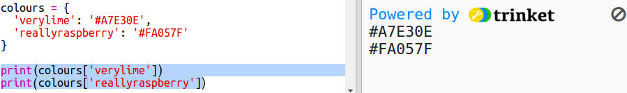

## ಬಣ್ಣ ನಿಘಂಟು

ಹೆಕ್ಸ್ ಬಣ್ಣ ಸಂಕೇತಗಳನ್ನು ಬಳಸುವುದು ನಿಜವಾಗಿಯೂ ಸುಲಭವಾಗಿರುತ್ತದೆ ಆದರೆ ಅವುಗಳನ್ನು ನೆನಪಿಟ್ಟುಕೊಳ್ಳುವುದು ಕಷ್ಟ.

ನಿಮಗೆ ಬಹುಶಃ ಈಗಾಗಲೇ ತಿಳಿದಿರುವಂತೆ, ಒಂದು ಪದವನ್ನು ಹುಡುಕಲು ಮತ್ತು ಅದರ ಅರ್ಥವನ್ನು ನೋಡಲು ನಿಘಂಟು ನಿಮಗೆ ಅನುಮತಿಸುತ್ತದೆ. Python‌ನಲ್ಲಿ, ನಿಘಂಟು ಇನ್ನೂ ಹೆಚ್ಚು ಮೃದುವಾಗಿರುತ್ತದೆ - ಇದು ನಿಘಂಟಿನಲ್ಲಿನ ಯಾವುದೇ 'ಕೀ'ಗೆ ಮೌಲ್ಯವನ್ನು ಹುಡುಕಲು ನಿಮಗೆ ಅನುಮತಿಸುತ್ತದೆ.

ಮಾನವ ಸ್ನೇಹಿ ಬಣ್ಣದ ಹೆಸರುಗಳಿಂದ (ಕೀಲಿಗಳಿಂದ) ಕಂಪ್ಯೂಟರ್ ಸ್ನೇಹಿ ಹೆಕ್ಸ್ ಕೋಡ್‌ಗಳಿಗೆ (ಮೌಲ್ಯಗಳು) ನಕ್ಷೆ ಮಾಡಲು ನಿಘಂಟನ್ನು ರಚಿಸೋಣ.

+ ಸುರುಳಿಯಾಕಾರದ ಆವರಣಗಳಲ್ಲಿ ನಿಘಂಟು ಇದೆ.
    
    `colours` ಎಂಬ ಖಾಲಿ ನಿಘಂಟನ್ನು ರಚಿಸಿ:
    
    

+ ನಿಮ್ಮ ಬಣ್ಣಗಳಿಗೆ ಒಳ್ಳೆಯ ಹೆಸರುಗಳನ್ನು ಆರಿಸಿ ಮತ್ತು ನಿಘಂಟಿಗೆ ನಮೂದುಗಳನ್ನು ಸೇರಿಸಲು `colours =` ಸಾಲನ್ನು ಸಂಪಾದಿಸಿ.
    
    ಉದಾಹರಣೆ ಬಣ್ಣ ನಿಘಂಟು ಇಲ್ಲಿದೆ:
    
    
    
    ಅಪೂರ್ಣವಿರಾಮ `:` ಕೀಲಿಯನ್ನು (ಬಣ್ಣದ ಹೆಸರು) ಮೌಲ್ಯದಿಂದ (ಹೆಕ್ಸ್ ಕೋಡ್) ಬೇರ್ಪಡಿಸುತ್ತದೆ. ನಿಮಗೆ ಅಲ್ಪವಿರಾಮ `,` ಪ್ರತಿ ಕೀ: ಮೌಲ್ಯ ಜೋಡಿ ನಡುವೆ ನಿಘಂಟಿನಲ್ಲಿ ಬೇಕು.

+ ಈಗ ನೀವು ಹೆಕ್ಸ್ ಕೋಡ್‌ಗಳನ್ನು ನೆನಪಿಡುವ ಅಗತ್ಯವಿಲ್ಲ, ನೀವು ಅವುಗಳನ್ನು ನಿಘಂಟಿನಲ್ಲಿ ನೋಡಬಹುದು.
    
    ನಿಮ್ಮ ಬಣ್ಣದ ಹೆಸರುಗಳನ್ನು ಬಳಸಲು ಈ ಕೆಳಗಿನ ಕೋಡ್ ಅನ್ನು ಹೊಂದಿಸಿ:
    
    
    
    ಕೀಯು ನಿಘಂಟಿನ ಹೆಸರಿನ ನಂತರ ಚದರ ಆವರಣಗಳ '[]' ಒಳಗೆ ಹೋಗುತ್ತದೆ.

+ ನಿಘಂಟಿನಲ್ಲಿ ಬಣ್ಣಗಳನ್ನು ನೋಡಲು ಈಗ ನೀವು ನಿಮ್ಮ ಕೋಡ್ ಅನ್ನು ನವೀಕರಿಸಬಹುದು:
    
    

+ ನಿಮ್ಮ ಪಠ್ಯ ಇನ್ನೂ ಸರಿಯಾಗಿ ಪ್ರದರ್ಶಿತವಾಗಿದೆಯೆ ಎಂದು ಖಚಿತಪಡಿಸಿಕೊಳ್ಳಲು ನಿಮ್ಮ ಕೋಡ್ ಅನ್ನು ಪರೀಕ್ಷಿಸಿ.