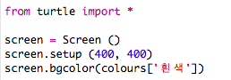
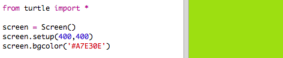
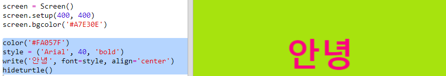

## 헥스 색상 코드 사용하기

파이썬 turtle은 '빨강', '하양' 과 같이 미리 정의된 색상을 가지고 있기도 하지만, 헥스 색상 코드를 사용할 수도 있습니다 (HTML & CSS 코스에서 이러한 헥스 색상 코드를 보셨을 겁니다.)

+ 빈 파이썬 템플릿을 엽니다. <a href="https://trinket.io/python/95059b88ed" target="_blank">trinket.io/python/95059b88ed</a>.

+ Turtle을 사용하기 위한 다음 설정 코드를 추가하십시오:
    
    
    
    위의 이미지에서 '하양' 라고 이름이 지정된 색상이 사용한 점을 참고하시기 바랍니다.

+ Turtle에는 사용할 수 있는 색상 이름 목록이 있지만, 때로는 자신만의 색상을 선택할 수 있습니다. Turtle에서 헥스 색상 코드를 사용할 수도 있습니다.
    
    <a href="http://jumpto.cc/colour-picker" target="_blank">jumpto.cc/colour-picker</a>를 열어 원하는 색상을 선택하십시오. '#A7E30E'와 같이 '#'으로 시작하는 헥스 코드를 찾습니다.

+ 해시(#)를 포함한 헥스 코드를 드래그하여 선택한 다음 마우스 오른쪽 단추로 클릭하거나, Ctrl-C를 입력하여 복사하십시오.

+ 이제 여러분이 선택한 색상으로 화면 색상을 설정하는 코드를 변경하십시오. 예시:
    
    
    
    마우스 오른쪽 버튼을 클릭 후 붙여넣기 또는 Ctrl-V를 입력하여 헥스 코드를 Trinket 안에 붙여 넣을 수 있습니다.

+ 또 다른 헥스 코드를 선택하고, 이를 사용하여 색상이 지정된 텍스트를 만듭니다:
    
    
    
    반드시 'Arial' 글꼴만 사용할 필요는 없습니다. 'Verdana', 'Times' 또는 'Courier'와 같은 글꼴을 적용해 볼 수 있습니다.
    
    '40'은 글꼴 크기입니다. 이 글꼴도 변경해보십시오.

+ 여러분이 보기에 정말 좋은 두 가지의 색깔 조합이 나올 때까지 다른 색깔 넣어 시도해보십시오.