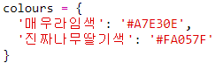
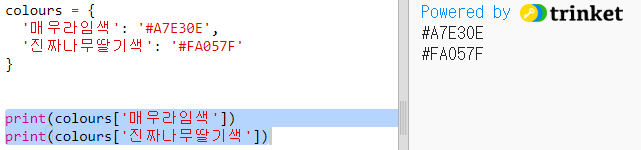

## 색상 사전

헥스 색상 코드를 사용하면 매우 유연하지만, 코드를 기억하기란 어려운 일입니다.

이미 알고 있듯이 사전을 사용하면 단어를 찾아보고, 그것의 의미를 확인할 수 있습니다. 파이썬에서 사전(이하 딕셔너리)은 앞서 이야기한 헥스 색상 코드보다 더욱 유연해서 딕셔너리 안의 어떤 '단어' 라도 그에 대한 의미를 찾아 볼 수 있습니다.

우리에게 친숙한 색상 이름(키)에서 컴퓨터에게 친숙한 색상이름인 헥스 코드(값)로 연결짓는 사전을 만들어 보겠습니다.

+ 딕셔너리는 중괄호 안에 들어 있습니다.
    
    `colours` 라고 불리는 빈 사전 만들기:
    
    

+ 색상에 걸맞는 멋진 이름을 짓고, 그 이름이 딕셔너리의 항목에 추가되기 위해 `clolurs =` 가 적혀진 줄을 편집하십시오.
    
    다음은 색상 딕셔너리 예제입니다.
    
    
    
    콜론 `: `은 값(헥스 코드)에서 키(색상 이름)를 분리합니다. 각각의 키:값으로 이루어진 짝들 사이에는 쉼표 `,`가 필요합니다.

+ 이제 헥스 코드를 기억할 필요가 없습니다. 딕셔너리에서 간단히 찾을 수 있습니다.
    
    색상 이름을 사용하여 다음 코드를 수정하십시오:
    
    
    
    키는 딕셔너리의 이름 뒤에 있는 대괄호 '[]' 안에 있습니다.

+ 이제 딕셔너리에서 색상을 찾기 위해 코드를 업데이트 할 수 있습니다:
    
    

+ 텍스트가 올바르게 표시되도록 코드를 테스트하십시오.