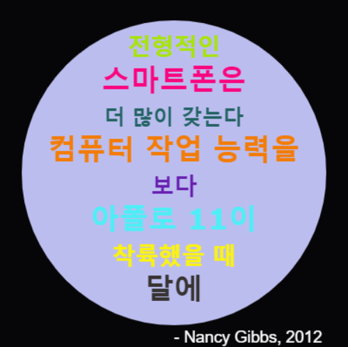

\--- 도전 \---

## 도전 과제: 포스터 만들기

디자이너는 사막이나 우주와 같이 특정 테마에 유용한 색상 '팔레트'를 만들곤 합니다.

테마별 색상 팔레트를 위한 딕셔너리를 사용하는 새 파이썬 프로젝트를 만들 수 있습니까? 가을, 숲, 바다, 성탄절, 아이스크림, 좋아하는 스포츠 팀의 색깔 또는 나만의 아이디어를 선택할 수 있습니다.

색상 팔레트 딕셔너리를 사용하여 포스터를 만들어 봅시다.

`forward`, `right`, `left`, `penup` 및 `pendown`과 같이 다른 turtle 명령을 사용할 수도 있습니다.

아마도 여러분의 포스터에 경계선을 추가할 수 있겠죠?

다른 유용한 turtle 명령들:

+ `circle(50)`은 반지름 50의 원을 그립니다.
+ `dot(100)`은 지름이 100인 원으로 채워줍니다. 

아래 예제를 참고하세요:

\--- /challenge \---