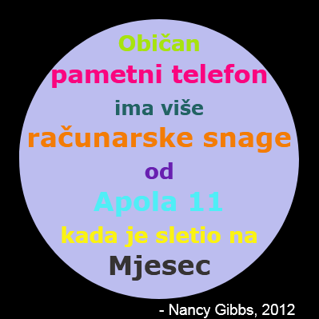

## Uvod

U ovom projektu napravićeš rječnik boja koji kôdove za boje koje je teško zapamtiti pretvara u jednostavne nazive.

  <iframe src="https://trinket.io/embed/python/813d63af23?outputOnly=true&start=result" width="600" height="500" frameborder="0" marginwidth="0" marginheight="0" allowfullscreen>
  </iframe>
  

### Dodatne informacije za vođe kluba

Ukoliko je potrebno da odštampate ovaj projekat, koristite [Verziju za štampu](https://projects.raspberrypi.org/me-ME/projects/colourful-creations/print).

--- collapse ---
---
title: Bilješke za vođe kluba
---
## Uvod:

U ovom projektu djeca se upoznaju sa rječnicima tako što kreiraju rječnik koji nazive boja koje je lako zapamtiti pretvara u heksadecimalne kôdove. Kôdove boja zatim pronalaze u rječniku i koriste ih za izradu raznobojnog postera.

## Online izvori

**U ovom projektu koristi se Python 3.** Preporučujemo korišćenje [trinketa](https://trinket.io/) za online pisanje u Pythonu. Ovaj projekat sadrži sljedeće Trinkete:

* [Početak projekta 'Šarene kreacije' -- jumpto.cc/python-new](http://jumpto.cc/python-new)

Takođe postoji trinket koji sadrži primjer rješenja izazova:

* [Završen projekat 'Šarene kreacije' -- trinket.io/python/813d63af23](https://trinket.io/python/813d63af23)

## Offline izvori

Ako želite, ovaj projekat može biti [izrađen offline](https://www.codeclubprojects.org/en-GB/resources/python-working-offline/). Izvorima projekta možete pristupiti klikom na link projekta 'Projektni materijali'. Navedeni link sadrži odjeljak 'Izvori projekta' u kojem se nalaze izvori koji će djeci biti potrebni kako bi izradila ovaj projekat offline. Obezbijedite da svako dijete ima pristup kopiji ovih izvora. Odjeljak sadrži sljedeće datoteke:

* colourful-creations/colourful-creations.py

Takođe, završenu verziju izazova ovoga projekta možete naći u odjeljku 'Izvori za volontere' koji sadrži:

* colourful-creations-finished/colourful-creations.py

(Sve navedene izvore moguće je preuzeti kao `.zip` datoteke.)

## Ciljevi učenja

* Rječnici - kreiranje i pronalaženje vrijednosti;
* Kornjačina grafika - tekst, fontovi i boje;

Ovim projektom obuhvaćeni su elementi iz sljedećih dijelova [Raspberry Pi Digital Making Curriculum](http://rpf.io/curriculum):

* [Koristite osnovne programske konstrukcije za kreiranje jednostavnih programa.](https://www.raspberrypi.org/curriculum/programming/creator)

* [Dizajniranje osnovnih 2D i 3D elemenata.](https://www.raspberrypi.org/curriculum/design/creator)

## Izazovi

* Još boja! - Koristi veb-sajt za biranje boja da pronađeš heksadecimalne kôdove za još boja i dodaš ih u rječnik. 
* Izradi poster - Kreiraj rječnik sa paletom boja po želji i koristi ga za izradu postera pomoću Kornjačine grafike. 

## Često postavljana pitanja

* Možda će biti potrebno podsjetiti djecu da stave zarez ',' na kraju svakog unosa u rječnik. 

--- /collapse ---

--- collapse ---
---
title: Projektni materijali
---
## Izvori projekta

* [.zip datoteka koja sadrži sve izvore projekta](resources/colourful-creations-project-resources.zip)
* [Online prazan Python Trinket](http://jumpto.cc/python-new)
* [Offline prazna Python datoteka](resources/new-new.py)

## Izvori za vođe kluba

* [.zip datoteka koja sadrži sve završene izvore projekta](resources/colourful-creations-volunteer-resources.zip)
* [Završen Trinket projekat online](https://trinket.io/python/813d63af23)
* [colourful-creations-finished/colourful-creations.py](resources/colourful-creations-finished-colourful-creations.py)

--- /collapse ---