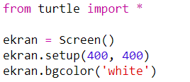
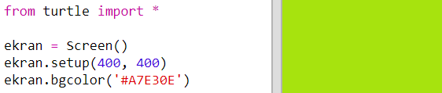
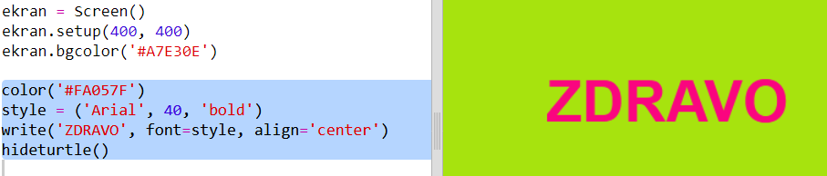

## Korišćenje heksadecimalnih kôdova boja

Python turtle (kornjača) sadrži unaprijed definisane boje kao što su 'red' (crvena) i 'white' (bijela), ali možeš da koristiš i heksadecimalne kôdove boja (možda si se sa njima već upoznao/upoznala tokom HTML i CSS kursa).

+ Otvori prazan Python šablon u Trinketu: <a href="http://jumpto.cc/python-new" target="_blank">jumpto.cc/python-new</a>.

+ Dodaj sljedeći kôd za korišćenje turtle (kornjače):
    
    
    
    Primijetićeš da si koristio/koristila naziv boje: 'white' (bijela).

+ Turtle sadrži listu naziva boja koje možeš da koristiš, ali ponekad ćeš željeti da odabereš sopstvene boje. Turtle ti dozvoljava i korišćenje heksadecimalnih kôdova boja.
    
    Otvori <a href="http://jumpto.cc/colour-picker" target="_blank">jumpto.cc/colour-picker</a> i odaberi boju koja ti se sviđa. Pronađi njen heksadecimalni kôd koji počinje znakom '#', kao na primjer '#A7E30E'.

+ Kopiraj heksadecimalni kôd, zajedno sa znakom taraba, tako što ćeš ga označiti, a zatim kliknuti na njega desnim tasterom miša i odabrati Copy (Kopiraj). Za kopiranje možeš koristiti i Ctrl-C.

+ Sada izmijeni red kôda koji podešava boju ekrana tako da koristiš svoju boju. Na primjer:
    
    
    
    Koristi desni taster miša i Paste (Nalijepi) ili Ctrl-V da preneseš svoj heksadecimalni kôd u trinket.

+ Odaberi novi heksadecimalni kôd za boju i upotrijebi ga da obojiš tekst:
    
    
    
    Ne moraš da koristiš font 'Arial'. Možeš isprobati fontove 'Verdana', 'Times' ili 'Courier'.
    
    '40' je veličina slova, pa možeš pokušati i to da izmijeniš.

+ Isprobaj različite boje sve dok ne pronađeš dvije koje ti se sviđaju i za koje misliš da se slažu.