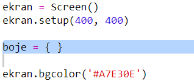
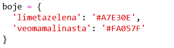
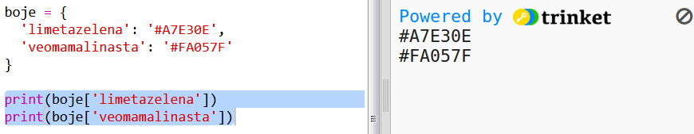
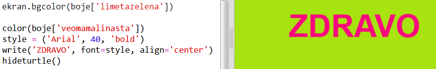

## Rječnik boja

Korišćenje heksadecimalnih kôdova boja je vrlo jednostavno, ali ih je teško zapamtiti.

Kao što vjerovatno već znaš, u rječniku možeš da pronađeš riječ i da pogledaš njeno značenje. U Pythonu, rječnik je još fleksibilniji - omogućava ti da pronađeš vrijednost bilo kojeg 'ključa' koji se nalazi u rječniku.

Napravimo rječnik koji će povezivati nazive boja (ključeve) koji su jednostavni za ljude sa heksadecimalnim kôdovima (vrijednostima) koji su pogodni za računare.

+ Sadržaj rječnika pišemo unutar vitičastih zagrada.
    
    Napravi prazan rječnik i daj mu naziv `boje`:
    
    

+ Odaberi zanimljive nazive za svoje boje i izmijeni red `boje =` kako bi dodao/dodala svoje boje u rječnik.
    
    Ovo je primjer rječnika boja:
    
    
    
    Dvotačka `:` odvaja ključ (naziv boje) od vrijednosti (heksadecimalnog kôda). Između svih ključ:vrijednost parova u rječniku mora da stoji zarez `,`.

+ Sada ne moraš da pamtiš heksadecimalne kôdove, već ih jednostavno možeš potražiti u rječniku.
    
    Prilagodi sljedeći kôd tako da koristi tvoje nazive boja:
    
    
    
    Ključ pišemo unutar uglastih zagrada '[]' nakon naziva rječnika.

+ Sada možeš da izmijeniš svoj kôd tako da pretražuje boje u rječniku:
    
    

+ Isprobaj svoj kôd da provjeriš da li se tvoj tekst i dalje prikazuje kako treba.