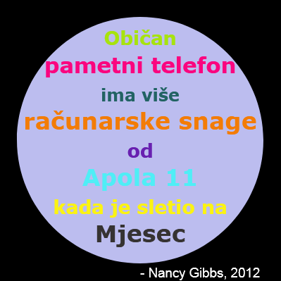

--- challenge ---

## Izazov: Izradi poster

Dizajneri za određene teme, kao što su pustinja ili svemir, često osmisle 'paletu' boja koje dobro izgledaju zajedno.

Možeš li da izradiš novi projekat u Pythonu koji će koristiti rječnik u kojem se nalazi paleta boja za specifičnu temu? Možeš da odabereš jesen, šumu, more, Božić, sladoled, boje svog omiljenog sportskog tima ili bilo koju temu koju želiš.

Izradi poster koristeći svoj rječnik boja.

Takođe, možeš koristiti ostale naredbe koje sadrži turtle i koje znaš, kao što su `forward`, `right`, `left`, `penup` i `pendown`.

Možda svom posteru možeš da dodaš i okvir?

Još neke korisne turtle naredbe:

+ `circle(50)` crta kružnicu poluprečnika 50.
+ `dot(100)` crta ispunjeni krug prečnika 100. 

Evo jednog primjera:

--- /challenge ---