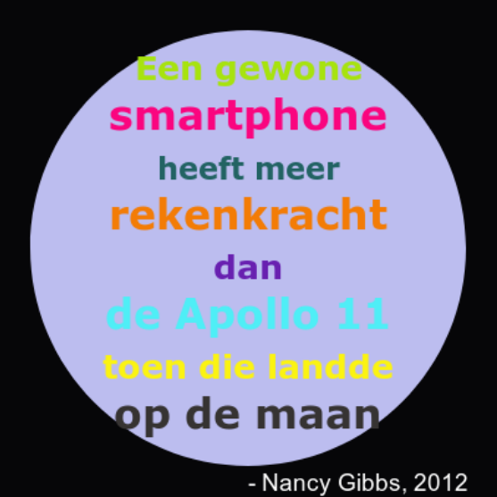

## Inleiding

In dit project maak je een kleurenwoordenboek waarin moeilijk te onthouden kleurcodes toegankelijkere namen krijgen.

  <iframe src="https://trinket.io/embed/python/53f5abf236?outputOnly=true" width="600" height="500" frameborder="0" marginwidth="0" marginheight="0" allowfullscreen>
  </iframe>
  

### Aanvullende informatie voor clubleiders

Als je dit project wilt afdrukken, gebruik dan de [printvriendelijke versie](https://projects.raspberrypi.org/nl-NL/projects/colourful-creations/print).

--- collapse ---
---
title: Opmerkingen voor clubleiders
---

## Inleiding:

Dit project introduceert woordenboeken door er een te maken die mensvriendelijke kleurnamen naar hexadecimale codes omzet. De kleurcodes worden vervolgens in het woordenboek opgezocht en gebruikt om er een ​​kleurrijke poster mee te maken.

## Online bronnen

**Dit project maakt gebruik van Python 3.** We raden aan om [trinket](https://trinket.io/) te gebruiken om Python online te schrijven. Dit project bevat de volgende Trinkets:

* ['Kleurrijke creaties' startpunt - jumpto.cc/python-new](http://jumpto.cc/python-new)

Er is ook een trinket met een voorbeeldoplossing voor de uitdagingen:

* ['Kleurrijke creaties' gereed - trinket.io/python/41a99e668b](https://trinket.io/python/53f5abf236)

## Offline bronnen

Dit project kan [offline worden voltooid](https://www.codeclubprojects.org/en-GB/resources/python-working-offline/) als dit de voorkeur heeft. Je kunt toegang krijgen tot de projectbronnen door op de koppeling 'Projectmaterialen' voor dit project te klikken. Deze link bevat een 'Projectbronnen'-sectie die bronnen bevat om dit project offline te voltooien. Zorg ervoor dat elk kind toegang heeft tot een kopie van deze bestanden. Dit gedeelte bevat de volgende bestanden:

* colourful-creations/colourful-creations.py

Je kunt ook een voltooide versie van de uitdagingen van dit project vinden in de sectie 'Vrijwilligersbronnen', met daarin:

* colourful-creations-finished/colourful-creations.py

(Alle bovenstaande bronnen kunnen ook worden gedownload als project en als vrijwilliger `.zip` bestanden.)

## Leerdoelen

* Woordenboeken - maken en opzoeken van waarden;
* Grafische elementen uit de Turtle-bibliotheek - tekst, lettertypen en kleuren;

Dit project behandelt elementen uit de volgende onderdelen van het [Raspberry Pi Digital Making Curriculum](http://rpf.io/curriculum):

* [Gebruik basale programmeerconstructies om eenvoudige programma's te maken.](https://www.raspberrypi.org/curriculum/programming/creator)

* [Ontwerp standaard 2D- en 3D-middelen.](https://www.raspberrypi.org/curriculum/design/creator)

## Uitdagingen

* Meer kleuren! - Gebruik een kleurenkiezerwebsite om hexadecimale codes voor meer kleuren te vinden en voeg die toe aan een woordenboek. 
* Maak een poster - Maak een eigen kleurenpaletwoordenboek en gebruik het om een ​​poster te maken met grafische elementen uit de Turtle-bibliotheek. 

## Veelgestelde vragen (faq)

* Herinner kinderen eraan dat aan het einde van elk woordenboekitem een komma ',' moet staan. 

--- /collapse ---

--- collapse ---
---
title: Projectmaterialen
---

## Projectbronnen

* [.zip-bestand met alle projectbronnen](resources/colourful-creations-project-resources.zip)
* [Online lege Python Trinket](http://jumpto.cc/python-new)
* [Offline leeg Python-bestand](resources/new-new.py)

## Bronnen voor de Clubleider

* [.zip-bestand met alle voltooide projectbronnen](resources/colourful-creations-volunteer-resources.zip)
* [Online voltooid Trinket-project](https://trinket.io/python/53f5abf236)
* [colourful-creations-finished/colourful-creations.py](resources/colourful-creations-finished-colourful-creations.py)

--- /collapse ---
