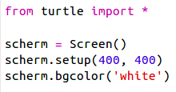
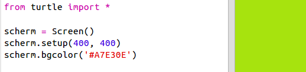
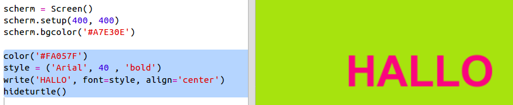

## Hexadecimale kleurcodes gebruiken

De Python Turtle (schildpad) bibliotheek heeft vooraf gedefinieerde kleuren zoals 'rood' en 'wit' maar je kunt ook hexadecimale kleurcodes gebruiken (mogelijk heb je dat al in de HTML & CSS-cursus gezien.)

+ Open de lege Python-sjabloon Trinket: <a href="http://jumpto.cc/python-new" target="_blank">jumpto.cc/python-new</a>.

+ Voeg de volgende code toe om de Turtle bibliotheek te installeren:
    
    
    
    Je ziet dat je een kleur hebt gebruikt met de naam: 'wit'.

+ Turtle heeft een lijst met kleurnamen die je kunt gebruiken, maar soms wil je je eigen kleuren kiezen. Met Turtle kun je ook hexadecimale kleurcodes gebruiken.
    
    Open <a href="http://jumpto.cc/colour-picker" target="_blank"> jumpto.cc/colour-picker </a> en kies de kleur die je mooi vindt. Zoek naar de hexadecimale code die begint met een '#', zoals '# A7E30E'.

+ Kopieer de hexadecimale code, inclusief het hekje, door het te selecteren en dan met de rechtermuisknop voor Kopiëren te kiezen, of door Ctrl-C te gebruiken.

+ Verander nu de regel code die de schermkleur instelt zodat je je eigen kleur krijgt. Bijvoorbeeld:
    
    
    
    Je kunt rechts klikken en Plakken, of Ctrl-V gebruiken, om je hexadecimale code in trinket te plakken.

+ Kies een andere hexadecimale kleurcode en gebruik die om gekleurde tekst te maken:
    
    
    
    Je hoeft het lettertype 'Arial' niet te gebruiken, je kunt ook 'Verdana', 'Times' of 'Courier' proberen.
    
    '40' is de lettergrootte, je kunt proberen ook dat aan te passen.

+ Probeer verschillende kleuren totdat je er twee hebt die je echt leuk vindt en die er samen goed uitzien.