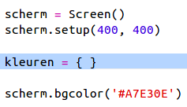
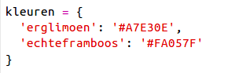
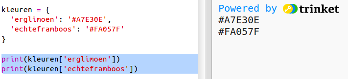
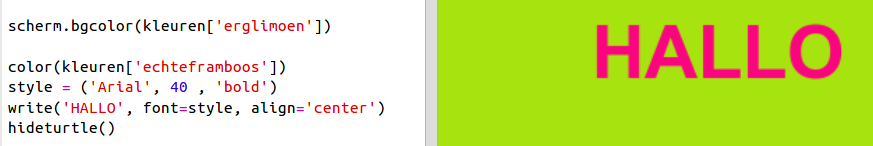

## Een kleurenwoordenboek

Het gebruik van hexadecimale kleurcodes is echt veelzijdig, maar ze zijn moeilijk te onthouden.

Zoals je waarschijnlijk al weet, kun je met een woordenboek een woord opzoeken en zien wat het betekent. In Python is een woordenboek nog veelzijdiger dan dat - je kunt een waarde opzoeken voor elke 'sleutel' in het woordenboek.

Laten we een woordenboek maken die mensvriendelijke kleurnamen (sleutels) naar computervriendelijke hexadecimale codes (waarden) in kaart brengt.

+ Een woordenboek staat tussen accolades.
    
    Maak een leeg woordenboek met de naam `kleuren`:
    
    

+ Kies coole namen voor je kleuren en bewerk de regel `kleuren =` om gegevens aan het woordenboek toe te voegen.
    
    Hier is een voorbeeld van een kleurenwoordenboek:
    
    
    
    Een dubbele punt `:` scheidt de sleutel (kleurnaam) van de waarde (hexadecimale code). Je hebt een komma `,` nodig tussen elk stel sleutel:waarde in het woordenboek.

+ Nu hoef je de hexadecimale codes niet meer te onthouden, je kunt ze gewoon opzoeken in het woordenboek.
    
    Pas de volgende code aan om je kleurnamen te gebruiken:
    
    
    
    De sleutel staat tussen vierkante haken '[]' achter de naam van het woordenboek.

+ Je kunt nu je code bijwerken om kleuren op te zoeken in het woordenboek:
    
    

+ Test je code om ervoor te zorgen dat de tekst nog steeds goed wordt weergegeven.