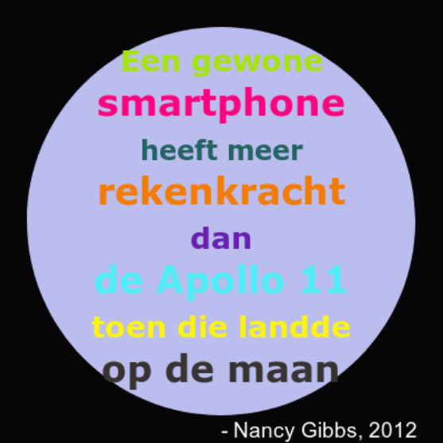

--- challenge ---

## Uitdaging: maak een poster

Ontwerpers maken vaak een 'palet' van kleuren die goed bij elkaar passen voor een bepaald thema, zoals woestijn of ruimte.

Kun je een nieuw Python-project maken dat een woordenboek gebruikt voor een thema-kleurenpalet. Je zou kunnen kiezen voor herfst, bos, zee, Kerstmis, ijs, de kleuren van je favoriete sportteam of voor je eigen idee.

Maak een poster met je kleurenpalet woordenboek.

Je kunt ook andere Turtle-opdrachten gebruiken die je kent, zoals `forward`, `right`, `left`, `penup` en `pendown`.

Misschien kun je een rand toevoegen aan je poster?

Andere nuttige Turtle-commando's:

+ `circle(50)` tekent een cirkelomtrek met straal 50.
+ `dot(100)` tekent een gevulde cirkel met diameter 100. 

Hier is een voorbeeld:

--- /challenge ---

***

### Door de community geleverde vertaling

Dit project werd vertaald door **Henny van Ham** en gecontroleerd door **Cor Groot**.

Onze geweldige vertalers helpen ons om kinderen over de hele wereld de kans te geven te leren coderen. Jij kunt ons helpen nog meer kinderen te bereiken door onze projecten te vertalen - lees meer op [rpf.io/translators](https://rpf.io/translators).
