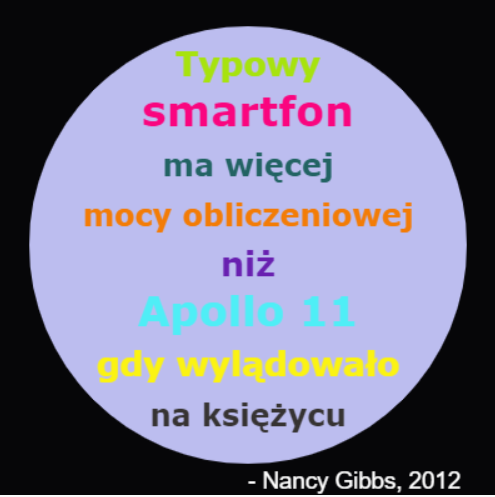

## Wprowadzenie

W tym projekcie utworzysz słownik kolorów, który tłumaczy trudne do zapamiętania kody kolorów na przyjazne nazwy.

  <iframe src="https://trinket.io/embed/python/c2849faf57?outputOnly=true&start=result" width="600" height="500" frameborder="0" marginwidth="0" marginheight="0" allowfullscreen>
  </iframe>
  

### Dodatkowe informacje dla liderów klubów

Jeśli chcesz wydrukować ten projekt, użyj [wersji do druku](https://projects.raspberrypi.org/pl-PL/projects/colourful-creations/print).

--- collapse ---
---
title: Notatki dla prowadzących klub
---

## Wprowadzenie:

Ten projekt wprowadza słowniki, poprzez stworzenie słownika, który tłumaczy przyjazne dla człowieka nazwy kolorów na kody heksadecymalne. Kody kolorów są następnie wyszukiwane w słowniku i wykorzystywane do tworzenia kolorowych plakatów.

## Zasoby Online

**Ten projekt używa Python 3.** Zalecamy użycie [trinket](https://trinket.io/) do pisania kodu w Pythonie online. Ten projekt zawiera następujące Trinkety:

* [Punkt startowy "Kolorowe Kreacje" - trinket.io/python/95059b88ed](https://trinket.io/python/95059b88ed)

Dostępny jest również trinket zawierający przykładowe rozwiązanie dla wyzwań:

* ["Kolorowe kreacje" - skończony projekt - trinket.io/python/c2849faf57](https://trinket.io/python/c2849faf57)

## Zasoby Offline

Ten projekt można także [ukończyć offline](https://www.codeclubprojects.org/en-GB/resources/python-working-offline/). Materiały potrzebne do wykonania projektu dostępne są po kliknięciu linku "Materiały do projektu". Ten odnośnik zawiera sekcję "Zasoby", których dzieci będą potrzebować, aby ukończyć ten projekt offline. Upewnij się, że każde dziecko ma dostęp do tych zasobów. Ta sekcja zawiera następujące pliki:

* colourful-creations/colourful-creations.py

Ukończoną wersję wyzwań z tego projektu można również znaleźć w sekcji "Zasoby dla wolontariuszy", która zawiera:

* colourful-creations-finished/colourful-creations.py

(Wszystkie powyższe zasoby można również pobrać jako pliki `.zip`.)

## Cele dydaktyczne

* Słowniki - tworzenie i wyszukiwanie wartości;
* Rysowanie za pomocą żółwia - tekst, czcionki i kolory;

Ten projekt obejmuje elementy z następujących wątków z [Programu nauczania Raspberry Pi Digital Making](http://rpf.io/curriculum):

* [Użycie podstawowych konstrukcji programistycznych do tworzenia prostych programów.](https://www.raspberrypi.org/curriculum/programming/creator)

* [Projektowanie podstawowych zasobów 2D i 3D.](https://www.raspberrypi.org/curriculum/design/creator)

## Wyzwania

* Więcej kolorów! - Użyj strony internetowej z listą kolorów, by poznać ich kod heksadecymalny i dodać je do słownika. 
* Stwórz plakat - Stwórz własny słownik z paletą kolorów i użyj go do wykonania plakatu za pomocą żółwia. 

## Często zadawane pytania (FAQ)

* Dzieci mogą potrzebować przypomnienia o przecinku "," na końcu każdego wpisu w słowniku. 

--- /collapse ---

--- collapse ---
---
title: Materiały do projektu
---

## Zasoby

* [Plik .zip zawierający wszystkie zasoby potrzebne do wykonania projektu](resources/colourful-creations-project-resources.zip)
* [Pusty Trinket Python online](https://trinket.io/python/95059b88ed)
* [Pusty plik Python offline](resources/new-new.py)

## Zasoby dla przewodniczącego klubu

* [Plik .zip zawierający wszystkie zasoby ukończonego projektu](resources/colourful-creations-volunteer-resources.zip)
* [Ukończony Trinket online](https://trinket.io/python/c2849faf57)
* [colourful-creations-finished/colourful-creations.py](resources/colourful-creations-finished-colourful-creations.py)

--- /collapse ---